<div align="center">

# KB Tune

### An on-device finance app that tells you what the next 7 days will cost — and what that does to your goal
<br/>


<br/><br/>

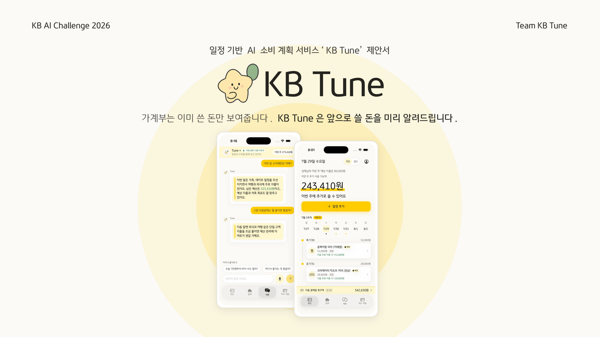

<sub><a href="README.md">한국어</a> · <b>English</b></sub>

</div>

KB Tune reads your card transactions and your calendar together. It forecasts how much
you'll spend over the next 7 days, whether a given expense will happen at all, and when.
If your savings goal looks like it's slipping, it proposes an adjustment — without touching
the spending you told it to protect.

Forecasting and personalization state are computed on the device. Nothing about your
schedule or savings changes until you approve it.

## 60-second summary

| Question | KB Tune's answer |
|---|---|
| What problem does it solve? | Ordinary budgeting apps only show money already spent. KB Tune shows **money about to be spent, and the chance your goal slips**, on a 7-day horizon. |
| What makes it different? | It reads **calendar events** alongside card transactions. Spending you've marked as protected is excluded from any adjustment. |
| How far does the AI go? | It computes amounts, occurrence probability, expected dates, and a safe estimate. It does not change your plan. It shows **a proposal and the reasons it ruled options out**, and leaves the choice to you. |
| How was it validated? | Separate models were compared for amount, safe amount, occurrence, and date. Each was evaluated on held-out users, seeds, and periods not used in training — and the personalization hypotheses that failed are published too. |
| How much is built? | Calibrated LightGBM, q75, and Hazard inference all run on-device, wired through to the Tune score, protection constraints, proactive alerts, approval, and the audit log. |

### How it works

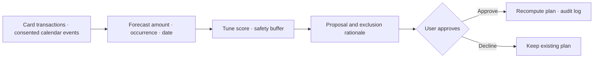

### Key validation results

| What was forecast? | Result | Where the app uses it |
|---|---:|---|
| **Median amount** for next week | Calibrated LightGBM WAPE **0.4151**, bias **−2.7%** | The expected-spend figure on screen |
| **Safe amount**, set with headroom | q75 cuts the share of under-forecast users **54.5% → 29.7%** | Safety buffer and risk judgement |
| **Whether it happens** within 7 days | Hazard + calendar Brier **0.1089** | Alerting you to an upcoming expense |
| **Which day** an event-driven expense lands | Date MAE **0.69d → 0.44d** | Expected-date and cycle explanations |

> [!IMPORTANT]
> These figures are relative comparisons from fresh hold-out experiments on **synthetic data**.
> They do not represent real customer performance or a measured behavioural improvement.
> Each experiment uses a different evaluation set, so numbers from different rows must not be compared directly.
> Cumulative Bayesian personalization did **not** demonstrate an advantage on the final hold-out.
> It therefore does not feed real user forecasts and runs in shadow mode only.

### Implementation and validation status

| Status | What was built and validated | What it currently means |
|:--:|---|---|
| ✅ Shipped in app | Calibrated LightGBM · q75 · Hazard, Tune score, protection constraints, approval, audit log | Visible directly in the demo. |
| 🧪 Passed hold-out | Amount · safe amount · occurrence probability · date | Grounds for choosing candidates, on synthetic data. |
| 🔒 Shadow mode | Per-user Bayesian residual personalization | Excluded from forecasts until a real pilot. |
| ⏳ Next validation | 20–50 users, 12-week chronological pilot | Real performance and calibration first; then a decision on enabling personalization. |

### Three-minute walkthrough

```bash
open KB_Tune.xcodeproj
```

Open the project, then tap through `Weekly → Tune score → compare proposals → approve → decision record`.
Three minutes covers the whole core loop. The default build runs with no API key and no network.
Full build and test commands are under [Running it](#run); experiment reproduction paths and
failure cases are in the [consolidated forecasting experiment write-up](docs/tune-experiments-2026-07-30.md) (Korean).

### Main screens

<div align="center">

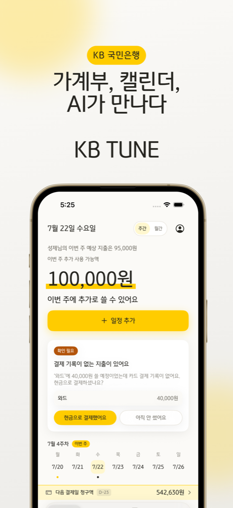
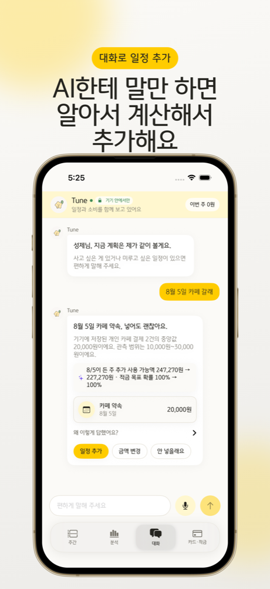
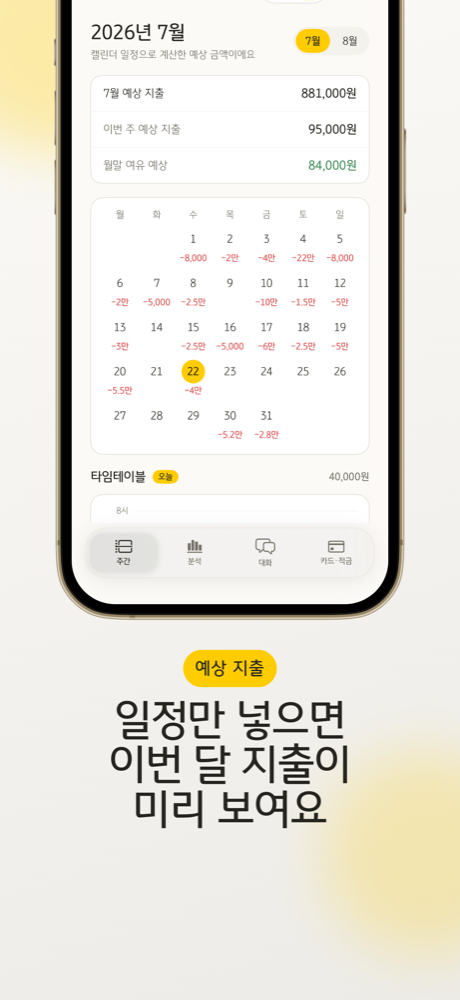
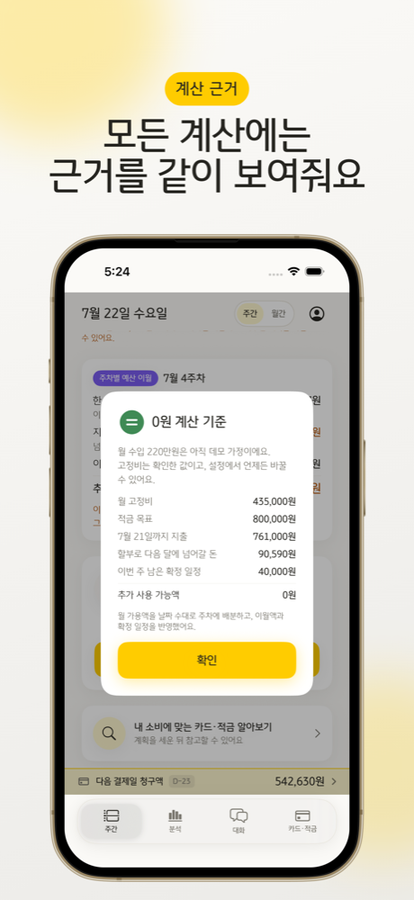

<sub>This week's budget · adding an event by chat · expected spending · calculation rationale</sub>

</div>

<br/>

<table>
<tr>
<td width="50%" valign="top">

**📖 &nbsp;[User guide](#user-guide)**

What the app does and how to use it

- [Why we built it](#why)
- [First launch](#getting-started)
- [The four screens](#screens)
- [What you can do by chatting](#chat)
- [How far does my data travel](#privacy)
- [Money in three states](#money-states)
- [Tune score and proactive alerts](#tune-score)
- [FAQ](#faq)

</td>
<td width="50%" valign="top">

**💻 &nbsp;[Developer documentation](#dev-docs)**

How it computes, and how it was built

- [Core loop](#core-loop)
- [How the chat works](#chat-flow)
- [Algorithms](#algorithms)
- [Model selection and validation](#model-selection)
- [Design principles](#principles)
- [Relation to public guidelines](#guideline)
- [Security design](docs/security.md)
- [Tech stack](#stack)
- [File layout](#structure)
- [Running it](#run)

</td>
</tr>
</table>

<br/>

---

<a id="user-guide"></a>

# 📖 User guide

<a id="why"></a>

## 🤔 Why we built it

> *"I've got 150,000 won left. If I go out next week, what's left after that?*
> *I still need to see a doctor, and I wanted to buy clothes..."*

Doing that arithmetic in your head rarely works out. Savings end up being the thing that slips.

Budgeting apps ask you to set budgets **in lumps** — "300,000 won for food."
But nobody spends in lumps. You spend **one dinner, one doctor's visit** at a time.

So KB Tune attaches an amount to each event instead.

```diff
- Food: 300,000 won      ← no idea how much is left
+ 40,000 won goes out this week, 60,000 won stays
```

## 🤝 Three things we always hold to

**We never change a number silently**
Every amount comes with the reason it is that amount.

> 💬 Your barber (Ward) cycle has been about 6 weeks.
> 16 May, 42,000 won · 27 June, 38,000 won

**We never just tell you to spend less**
Whatever you marked as "I'm not giving this up" stays untouched. Savings are found elsewhere.

**We don't lead with product sales**
Cards and savings accounts appear only after the plan is set. Cash flow comes first.

<br/>

<a id="getting-started"></a>

## 🚀 First launch

|  | What you do | What happens |
|:--:|---|---|
| 1️⃣ | **Read and choose consents** | Three separate questions. The full notice text is shown expanded, not collapsed.<br/>One required consent is enough to start; the other two are optional and everything still works without them. |
| 2️⃣ | **Connect your calendar, answer a few questions** | Monthly income, how much you want to save, and the spending you won't give up.<br/>Anything you mark as protected stays protected later. |
| 3️⃣ | **Open the app** | One large number greets you: how much more you can spend this week.<br/>Rent, phone bill, savings, and already-scheduled plans are already subtracted. |
| 4️⃣ | **Add an event** | Type just a title and the amount fills itself in.<br/>Before you commit, it shows *"here's what's left if you add this."* |
| 5️⃣ | **Tap the Tune score** | It checks whether the current plan holds your savings goal, a safe balance, and your protected spending at once.<br/>If the score is low, you get proposals and the reasons other options were excluded. |
| 6️⃣ | **Check the Analysis tab on the weekend** | Where the money went, and what's still coming. |

> Consent is asked **before** the calendar is connected. Asking afterwards would mean asking about titles we'd already read.

<br/>

<a id="screens"></a>

## 📱 The four screens

| Tab | What it's for |
|---|---|
| 🗓️ **Weekly** | How much more you can spend this week, plus the Tune score.<br/>Tapping the score opens the proposals, exclusion reasons, and calculation rationale. |
| 💬 **Chat** | Ask in plain language, change things in plain language.<br/>*"How much have I spent on cafés this month?"* · *"I want to go to a café on 5 August"* · *"Push one of my plans back"* |
| 📊 **Analysis** | Where your money goes.<br/>Money already spent and money still to come are colour-separated. |
| 💳 **Cards & savings** | Finds the card that suits your actual spending.<br/>Ranked by how much you'd actually gain per month. |

Settings live behind the circle at the top right of the Weekly screen.
Tabs also swipe left and right. **Tapping Weekly again while on Weekly** scrolls back to the top.

<br/>

<a id="chat"></a>

## 💬 What you can do by chatting

Most finance-app chatbots answer with "shall I connect you to customer support?"
In KB Tune, **both asking and changing** happen inside the conversation.

### What you can ask

**1. Money already spent**

```
you  How much have I spent on cafés this month?

☁️   Cafés come to 20,000 won so far.
     That's 12,000 won on 7/3 and 8,000 won on 7/11.
```

The total isn't precomputed — it's summed on the spot.
Which is why "which is higher, eating out or cafés?" also works.

**2. Whether you can afford something**

```
you  Can I buy a 70,000 won pair of trousers today?

☁️   You have 62,000 won of room this week. 70,000 puts you 8,000 over.

     Pushing Friday's plan to next week returns 52,000 won, which covers it.

     [ Move to next week ]  [ Buy it anyway ]
```

**3. Adding an event by voice or text**

```
you  I want to go to a café on 5 August

☁️   A café on 5 August fits fine.
     20,000 won — the median of 2 café payments stored on your device.
     Observed range 10,000–30,000 won.

     Spendable for the week of 8/5: 314,896 won → 294,896 won

     [ Add event ]  [ Change amount ]  [ Skip it ]
```

The date (`5 August`) and the type (`café`) are parsed on the phone.
The amount comes from **your own past café payments** — the median, not the mean,
because one large outlier drags a mean upward.

### It actually changes things

Tapping a button inside the message really adds the event, and the budget figures move immediately.
It's saved to your device calendar too.

| Button | What it does |
|---|---|
| **Add event** | Goes into the calendar, and this week's remaining amount drops accordingly |
| **Move to next week** | The event moves and this week's amount comes back |
| **Change amount** | Lets you override the proposed figure |
| **See cards** | Jumps to the card screen matched to your spending |

### It doesn't invent numbers

This matters most. An AI getting a number wrong in a finance app isn't acceptable.

**Amounts are not produced by the AI.** The app computes them, hands them over, and the AI only
writes sentences around them. Adding or comparing the given numbers is allowed; producing a
number that was never given gets caught.

```
✅  12,000 won + 8,000 won = 20,000 won   ← arithmetic on given numbers
✅  118,500 won as "about 120,000 won"    ← rounding
❌  125,000 won                            ← appears nowhere
```

When it's caught, **(check needed)** is appended next to that number only. The whole answer is
not thrown away — losing three correct sentences over one wrong number is a bad trade.
If more than three are wrong, the answer is replaced with an app-generated one.

### It doesn't ramble

Ask how much you spent and one or two sentences is the whole answer.
Reasons and options only appear when you ask whether you can afford something.

The tone was reworked too. It used to answer like this:

```diff
- The reason is that your additional spendable amount this week is 62,000 won,
- and while your remaining monthly budget is 204,000 won, upcoming scheduled
- events are projected at 801,000 won, making it difficult to view your café
- budget as comfortable.  (four paragraphs of this)

+ Cafés come to 20,000 won so far. That's 12,000 won on 7/3 and 8,000 won on 7/11.
```

Sentences are blocked from opening with "The reason is", "The impact is", or "The suggested action is".
Written that way it reads as a filing, not a conversation.

### Works offline

If the server is unreachable, the phone answers instead — from a prepared set of replies.
**What matters is that the numbers are identical.** If the screen says 62,000 won, so does the chat.

### Voice input too

Press the mic and talk. Speech recognition runs entirely on the phone.
No recording is stored and nothing is sent to Apple's servers.

<br/>

<a id="privacy"></a>

## 🔒 How far does my data travel?

**On default settings, there is nothing to worry about.** Install it, open it, and it never calls an
external AI. Budget calculation, adding events, and amount forecasting all finish on the phone.

**Free-form conversation does need a model, though.** The app works without an external AI, but you
have to turn it on if you want web lookups or answers to harder questions.

With it on, here's what leaves:

| | Does it leave? |
|---|---|
| Your name | **No** — the server has no field to receive it |
| Your age band | **No** — kept on the phone, used only as a multiplier on reference prices (optional) |
| Your question, verbatim | **No** — the phone converts it to a form like `café spending question` |
| A sentence you sent with web search on | Yes, verbatim — see below |
| **Stored event titles** | **No** — the phone substitutes something like `[social event]` |
| A new event name you just typed | Yes, if "AI features" is on (off by default) |
| Receipt captures and the text read from them | **No** — read on the phone |
| Voice | **No** — recognised on the phone only |
| Dates · types · amounts, budget figures | Yes, when on |

### Which is why consent is asked as three separate questions

On first launch the full notice text is shown **expanded, not collapsed**, and each item is tapped
separately. There is no single "agree to all" button.

| Item | If you don't tap it |
|---|---|
| **[Required]** Collection and use of personal data <sub>Art. 15</sub> | The start button stays disabled.<br/>Only what's strictly needed to compute a budget from dates and amounts. |
| [Optional] Sensitive data <sub>Art. 23</sub> | **Event titles are never read at all.** You just pick the spending type yourself. |
| [Optional] Cross-border transfer <sub>Art. 28-8</sub> | Answers are generated by the on-device engine.<br/>Recipient, country, items, retention period, and right of refusal are all written out in the notice. |

**Both optional consents can be declined with every feature still working.** They can be toggled at any
time in settings, and the full notice text can be reopened.

The "AI features" switch *is* the cross-border transfer consent. Letting the two drift apart would
create the *withdrew consent but data still flows* failure, so the on/off path is a single control.
Turning it off stops transmission from that moment.

### Titles aren't masked — they're never read

If you decline the sensitive-data consent, the **title field is skipped entirely** when events are
pulled from the calendar. Inside the app it's just `Event`. Not masked afterwards — never taken in
to begin with.

That's stronger than masking on the way out. Masking leaks the moment one rule misses.
**If it was never read, there's nothing to miss.**

Some events — travel, for example — have no match in public statistics or in your own history.
With web search on, those get looked up, and **the search query is rebuilt from words that exist in
the code.** Not one word of the title travels.

```diff
  Event title      Jeju 3-night 4-day trip
- Not sent as      "Jeju 3-night 4-day trip cost"
+ Sent as          "average per-person cost, 3-night domestic trip"
```

Only three things are read: the event type (`travel`), a number like `3 nights`, and whether it's
overseas. `Jeju` survives nowhere. This isn't place-name scrubbing — it's that **a word not in the
code has no path out**, so a missing entry in a place-name dictionary can't leak anything.

**Stored event titles never leave under any circumstances.** The phone substitutes something like
`[social event]` first. Titles contain things like `"orthopaedic appointment"` or `"church meeting"` —
health and religion are more sensitive than an amount.

**Turning on "AI features" adds exactly one thing**: the new event name inside the sentence you just
typed. Saying *"add the Jeju trip on 14 August"* only works if the AI can parse those words.
Names, contacts, addresses, account numbers, and every other stored event title are still masked.

Turn it off and only the on-device budget and pattern engines run. Events are edited from the Weekly screen.

### Web search is the one exception

Searching `"Itaewon restaurants"` requires that phrase to travel — remove the place and there's
nothing left to search. So search is kept separate from everything else.

- **It only runs when you turn it on.** Tap the magnifier at the left of the chat input; tap again to
  turn it off. While on, the badge at the top reads `Search on`, so which mode you're in is always visible.
- **Only that one sentence leaves.** No events, no budget, no card history. The server has no fields
  for them.
- **Search results stay in the conversation** so you can follow up with "then budget for that trip."
  That answer travels as context in the next turn — but it's public information from the web.

> [!NOTE]
> **We intend to remove even this.**
> An external AI is used for now, but the backend is built so a KB-operated model can be swapped in.
> The conversation feature would work identically with no data leaving KB.

**What happens after it leaves?** OpenAI API data is not used for model training by default, but
retention depends on which API was called and on your organization's data-control agreement.
Default abuse-monitoring logs may be retained for up to about 30 days, and Responses API application
state can persist beyond 30 days depending on configuration. Zero Data Retention is not automatic —
it is a separately approved option with its own requirements. KB Tune therefore does not promise
"deleted within 30 days" or "never retained" until such an agreement is in place. Current terms are at
the [OpenAI API data controls documentation](https://developers.openai.com/api/docs/guides/your-data#data-retention-controls-for-abuse-monitoring).

For more, see **[Security design](docs/security.md)** (Korean) — including what hasn't been solved yet.

<br/>

<a id="money-states"></a>

## 🎨 Money in three states

"800,000 won this month" doesn't tell you whether it's already spent or still coming.
So it's split three ways.

| State | Meaning | On screen |
|---|---|---|
| 🟡 **Committed** | Already spent, or certain to go out | **Yellow** in Analysis |
| 🕐 **Reserved** | Attached to an event but not yet paid | **Reserved** badge |
| ⬛ **Pattern-expected** | Not in the calendar, but the cycle is due | **Dark grey** in Analysis |

> [!IMPORTANT]
> **A reservation is not a withdrawal.**
> No money leaves your account. It's only deducted from what you can spend.
>
> *"Reserve 100,000 won for the 2 August date in your August plan? Nothing is actually withdrawn."*

<br/>

<a id="tune-score"></a>

## 🎚️ Tune score and proactive alerts

Below this week's spendable amount sits the **Tune score**. It doesn't just check whether a lot of
money is left — it checks whether the savings goal can be sustained, whether the balance through the
risky stretch is safe, and whether your protected spending can be left alone.

```
Tune score 72 · data confidence: medium

Recommended   Move the team dinner to next week      72 → 84
Alternative   Reduce the shopping amount             72 → 78
Excluded      Cancel the get-together                marked as protected spending
Excluded      Cancel the savings auto-transfer       damages a long-term goal
```

When transaction changes, upcoming events, and card billing dates converge and the score drops
sharply, the app tells you first. But it **never changes an event or a savings plan automatically.**
The plan is only recomputed after you've reviewed the proposal and the exclusion reasons and
approved it. The judgement and approval record survives an app restart.

> [!NOTE]
> The current Tune score weights are product policy v0. They are not causally validated coefficients
> demonstrating real behavioural improvement. `Data confidence: low · medium · high` is always shown
> alongside the score.

<br/>

## 🔮 Expected spending

Some money goes out on schedule even though it's not in your calendar. That gets flagged in advance.

```
🛒 Coupang grocery run       around 7/23    expected 35,000 won

   Your Coupang grocery cycle has been about 10 days.
   23 June 34,000 won · 3 July 36,000 won · 13 July 35,000 won

   [ Add to plan ]   [ Skipping it this time ]
```

> [!NOTE]
> **This amount is not pre-deducted from your budget.**
> It only counts once you tap "Add to plan". Money shouldn't quietly disappear behind your back.

<br/>

<a id="faq"></a>

## ❓ FAQ

<details>
<summary><b>Does reserving money withdraw it?</b></summary>
<br/>

No. Your account is untouched. It's deducted only from "what you can spend".

</details>

<details>
<summary><b>Why isn't expected spending subtracted from what's left?</b></summary>
<br/>

Because it isn't confirmed. It counts once you tap "Add to plan".

</details>

<details>
<summary><b>If I cancel an event, does the money come back?</b></summary>
<br/>

For now, "Move to next week" is how you relieve this week's load.
Reclaiming only confirmed refunds is a later feature.

</details>

<details>
<summary><b>What does an amount marked "expected" mean?</b></summary>
<br/>

That it isn't certain yet. Certain amounts don't carry the label.
So if "expected" isn't there, you can trust the number.

</details>

<details>
<summary><b>Is the Tune score my credit score?</b></summary>
<br/>

No. It is not used for credit assessment or loan underwriting. It's an in-app planning score from
0 to 100 indicating whether the current plan can hold your savings goal, a safe balance, and your
protected spending together. Score and data confidence are displayed separately, and a low score
never causes the app to execute a financial action on its own.

</details>

<details>
<summary><b>Does it work without internet?</b></summary>
<br/>

Yes. Budget calculation, adding events, and amount forecasting all happen on the phone.
The app behaves identically with the server down. Only the chat switches to prepared replies.

</details>

<details>
<summary><b>Do my event titles go to the server?</b></summary>
<br/>

**If you declined the sensitive-data consent, they're never read.** The title field is skipped when
importing from the calendar, so inside the app it's just `Event`. There is no title to send.

**Even if you consented, stored titles don't leave.** The phone substitutes something like
`[social event]` first. Normally only `5 August · café · 20,000 won` — date, type, amount — travels.

**Turning on "AI features" in settings** adds one thing: the new event name inside the sentence you
just typed, because adding and editing events by conversation requires the AI to parse it. Off by default.

Even then, names, contacts, addresses, account numbers, and other stored event titles stay masked, and
**only app-constructed phrasing reaches the search engine** — e.g. `average per-person cost, 3-night
domestic trip`. If the AI tries to put a word like `Jeju` into a query, the server inspects it and blocks it.

</details>

<details>
<summary><b>I just installed it — where do the amounts come from?</b></summary>
<br/>

From public statistics. They aren't made up.

Three sources: Korea Consumer Agency *Chamgagyeok* (per-portion dining prices, salon rates),
Statistics Korea Household Income and Expenditure Survey (monthly average spending for single-person
households), and Seoul Open Data Plaza commercial-district analysis (per-transaction card amounts by
industry and age band).

**The source is always printed next to the amount.**
As your real spending accumulates, those values replace the statistics.

</details>

<details>
<summary><b>What if the AI states a number incorrectly?</b></summary>
<br/>

Amounts are computed by the app, not generated by the AI — the AI only writes sentences around them.
If it states a number the app never supplied, **(check needed)** is appended next to that number.
If too many are wrong, the whole answer is replaced with an app-generated one.

</details>

<details>
<summary><b>Is the card recommendation an advertisement?</b></summary>
<br/>

No. It calculates how much you'd actually gain per month from using that card given your spending,
and ranks accordingly. Annual fees are subtracted. If there's no gain, it says so.

</details>

<br/>

---
---

<a id="dev-docs"></a>

# 💻 Developer documentation

<a id="core-loop"></a>

## 🔁 Core loop

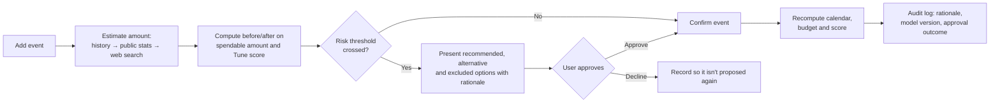

The numbers on screen really move. Add an event and the large figure drops; the Tune score and goal
probability shift with it. Cross the risk threshold and that event gets a warning. Tap "Move to next
week" and the event moves while this week's amount returns.

<br/>

<a id="chat-flow"></a>

## 💬 How the chat works

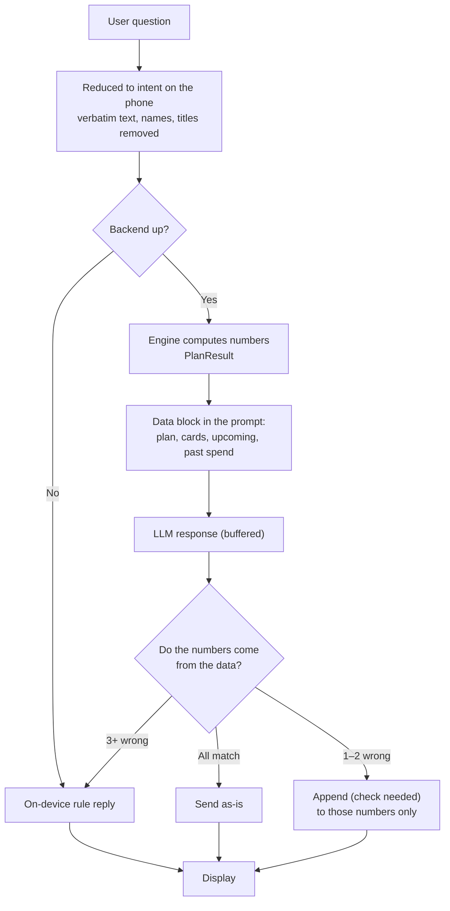

**Tokens are buffered on the server and checked, not streamed straight through.** Streaming directly
means a fabricated amount in the final token can't be taken back. Only what passes the check reaches
the screen.

The allow-list is built like this (`allowed_chat_numbers`):

| What goes in | Why |
|---|---|
| Engine-produced numbers (`grounded_numbers`) | The basis of the plan |
| On-screen numbers (`app_numbers`) | The chat can't say something different from a screen showing 62,000 won |
| Card billing amounts and dates | Not part of the monthly budget but essential to advice |
| Per-event amounts and dates | "How much was that plan again?" |
| **Per-type and overall totals** | Arithmetic we asked for must not be flagged as fabricated |
| **Rounded forms of the above** | Allow "about 120,000 won" while still blocking 125,000 won |

Rather than widening a tolerance, **the rounded values themselves are added to the list.**
A 5,000-won tolerance would let 545,000 through on the grounds that 542,630 was allowed.

<br/>

<a id="algorithms"></a>

## 🧮 Algorithms

<a id="model-selection"></a>

### Model selection and validation

KB Tune does not use one model for amount, date, risk, and personalization. The cost of the same
error differs depending on whether you got `the amount wrong`, `missed an occurrence`, or
`underestimated a budget shortfall` — so the model and the metric are separated by role.

| Product question | Final candidate | Selection rationale | Current status |
|---|---|---|---|
| **How much** will I spend next week | Bias-calibrated LightGBM median | Trade-off between point WAPE and bias | Passed synthetic hold-out · on-device |
| **How much to set aside** to avoid falling short | LightGBM q75 | Lowest loss at 2× and 3× under-forecast cost | Passed synthetic hold-out · on-device |
| **Will it happen** in the next 7 days | Hazard + calendar for event-driven, Hazard otherwise | Brier 0.1089, better than weekly LightGBM | Passed synthetic hold-out · on-device |
| **When** will it happen | Hazard + calendar for event-driven, Hazard otherwise | Event-driven date MAE 0.69d → 0.44d | Passed synthetic hold-out · on-device |
| Does it **personalize automatically** with long use | Bayesian sufficient statistics, shadow mode | Unqueried generalization not confirmed on fresh hold-out | Not user-visible |
| Is the current plan **safe** | Deterministic Tune score + protection constraints | Unit-tested rationale tracing, approval, audit log | Implemented in app |

> [!IMPORTANT]
> Most figures below are relative comparisons on synthetic data. They are not real customer
> performance or causal effects. Generation seeds, evaluation periods, and denominators differ per
> experiment, so **only compare values within the same table**.

The selected models ship as a 2.4 MB neutral JSON tree, version `forecast-synth-v1-2026-07-30`.
The Swift runtime computes median, q75, occurrence probability, and expected date with no server call,
and a golden test compares Swift results against fixed inputs generated by Python. The app records the
model and feature version in the Tune detail view and the audit log. The model file contains only
trees, population priors, and calibration coefficients — no raw transactions, no user IDs.

#### 1) Median amount: LightGBM + separate per-user bias calibration

Occurrence and conditional amount are trained separately, then recombined. The global non-linear
baseline is [LightGBM](#ref-lightgbm).

$$
\hat y_{raw}(x)
= \hat p(\text{occurrence}\mid x)\;\mathrm{expm1}\!\left(\hat m_{\log}(x)\right)
$$

Structural under-bias is reduced using a total-ratio correction computed on a calibration user set
$\mathcal C$ held out of training.

$$
c=\mathrm{clip}\left(
\frac{\sum_{i\in\mathcal C} y_i}
     {\sum_{i\in\mathcal C}\hat y_{raw,i}},
0.75,1.35\right),
\qquad
\hat y_{center}=c\hat y_{raw}
$$

On weeks 8–12 for 300 fresh hold-out users, the uncalibrated LightGBM had WAPE 0.4192 and bias −14.2%.
After bias calibration, WAPE was **0.4151** and bias **−2.7%**. Ridge gave WAPE 0.4504 and bias −4.5% —
a stable comparison baseline, but calibrated LightGBM was better on final median accuracy.

#### 2) Safe amount: q75 quantile regression

In a budgeting app, forecasting below actual spending is the more dangerous error. With under-forecast
cost $k$ and over-forecast cost 1, the loss is:

$$
L_k(y,\hat y)=k(y-\hat y)_+ +(\hat y-y)_+
$$

The optimal quantile for this loss is $\tau=k/(k+1)$. Setting the under-forecast cost to 3× gives
$\tau=3/4=0.75$, hence q75. LightGBM learns this quantile directly by minimising pinball loss. The
choice rests on [quantile regression](#ref-quantile-regression), which estimates a conditional
quantile rather than a mean.

$$
\rho_\tau(u)=u\left(\tau-\mathbf 1[u<0]\right),
\qquad
\hat q_\tau(x)=\arg\min_q\sum_i\rho_\tau(y_i-q(x_i))
$$

| Under-forecast cost | Lowest-loss model | Loss ↓ |
|---:|---|---:|
| 2× | q75 | 0.6164 |
| 3× | q75 | 0.7604 |
| 5× | q83 | 0.9485 |

q75 has WAPE 0.4723 and bias +18.4% — far too conservative as a central forecast. Instead it lowers
the share of under-forecast users from 54.5% to **29.7%**, and is used as the safety input for
cash-shortfall risk and the Tune score. `Expected spending` and `safe estimate` are never shown as the
same number on screen.

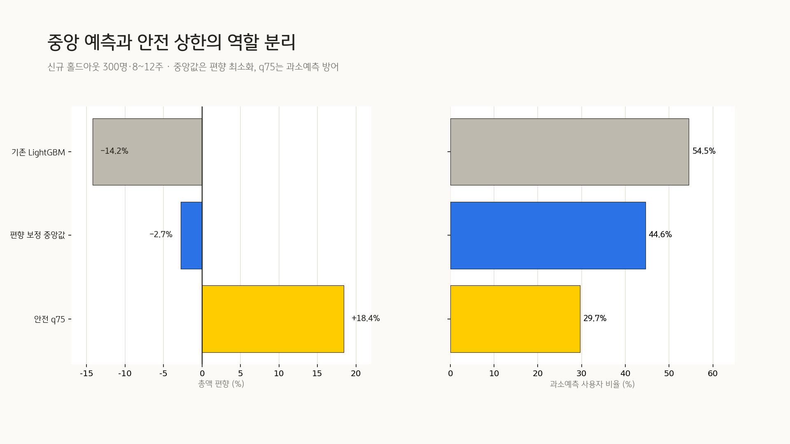

#### 3) Date and cycle: daily discrete-time Hazard

For each day $d\in\{0,\ldots,6\}$, the probability of occurrence today conditional on not having
occurred yet. To handle weekly occurrence and date distribution together, the hazard formulation of a
[discrete-time survival model](#ref-discrete-survival) is used.

$$
h_d=P(T=d\mid T\ge d, x_d)
$$

Daily hazards convert to a weekly occurrence probability and a date probability mass:

$$
P(T\le6)=1-\prod_{d=0}^{6}(1-h_d),
\qquad
P(T=d)=\left[\prod_{j<d}(1-h_j)\right]h_d
$$

The expected payment date is the $d$ maximising $P(T=d)$. The cycle is the interval from the last
observed payment to that date. For users who consented to calendar access, only `event today`,
`event ±1 day`, and `event count this week` are added as known-future features — title text is never
a model input.

Results over 12 weeks: 240 training users, 60 probability-calibration users, 100 fresh evaluation
users × 3 seeds.

| Model | Brier ↓ | PR-AUC ↑ | ECE ↓ | Date MAE ↓ | ±1 day hit rate ↑ |
|---|---:|---:|---:|---:|---:|
| Cycle baseline | 0.1564 | 0.7628 | 0.0251 | 1.89d | 49.9% |
| Weekly LightGBM | 0.1278 | 0.8233 | **0.0108** | 1.89d | 49.9% |
| Daily Hazard | 0.1244 | 0.8346 | 0.0108 | 1.69d | **58.6%** |
| **Hazard + calendar** | **0.1089** | **0.8622** | 0.0133 | **1.64d** | 58.5% |

Error in the probability itself is measured by [Brier score](#ref-brier), ranking quality on sparse
occurrence events by [PR-AUC](#ref-pr-curve), and agreement between stated probability and observed
frequency by ECE.

The calendar effect concentrates in event-driven spending. Date MAE for get-togethers and dates fell
from 0.69d to **0.44d**, while non-event-driven spending stayed effectively flat at 1.91d. Calendar
features are therefore not forced onto all spending.

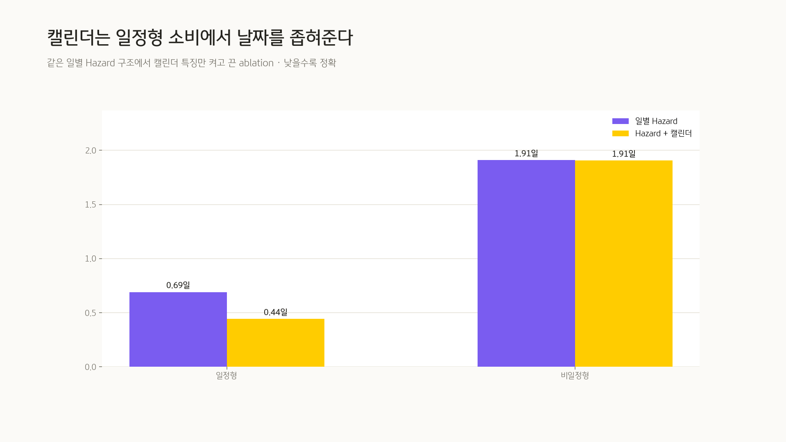

#### 4) On-device Bayesian: explanation, intervals, shadow mode

The current Swift `SpendModel` stores only sufficient statistics per user × category — never raw transactions.

$$
N(\Delta)\sim\mathrm{Poisson}(\lambda\Delta),
\quad \lambda\sim\mathrm{Gamma}(a,b)
$$

$$
\log X\sim\mathcal N(\mu,\sigma^2),
\quad \mu\sim\mathcal N(\mu_0,\tau^2)
$$

$$
T\sim\mathrm{Weibull}(k,\eta),
\quad \eta=\frac{1}{\lambda\Gamma(1+1/k)}
$$

This structure updates in a few additions with no server transmission, and makes occurrence
probabilities, amount intervals, and explanatory rationale easy to produce. The
[Weibull distribution](#ref-weibull) was chosen for the interval distribution for its flexibility over
positive time gaps. Long-run personalization performance, however, was a separate question:

- Initial controlled experiment assuming strongly stable personal preferences: **42.6% WAPE improvement** from week 1→8
- 12-week experiment including lifestyle change, feedback noise, and unqueried evaluation: **−2.13pp** at 8 weeks, **+0.43pp** at 12 weeks
- Ridge + Bayesian with separated development and final seeds: **−0.19pp** at 8 weeks, **−0.77pp** at 12 weeks

Since the final confidence interval did not exclude zero, no claim is made that "it keeps improving
automatically the longer you use it." The Bayesian state is used for pattern explanation and interval
generation, while cumulative residual personalization stays in shadow mode — not shown to users —
until a real 12-week pilot.

#### 5) Tune score: the policy engine turning forecasts into user decisions

The Tune score is not a model-accuracy score. It measures the degree to which the current plan holds
the goal, the balance, and protected spending together. The v0 weights in code are:

$$
\text{Tune}=\mathrm{round}(0.55G+0.30L+0.15V)
$$

$$
G=100\cdot\mathrm{clip}(p_{goal},0,1)
$$

Low confidence demands a larger safety buffer for the same balance:

$$
B_{eff}=B_{base}\times
\begin{cases}
1.50,& \text{low}\\
1.25,& \text{medium}\\
1.00,& \text{high}
\end{cases},
\qquad
L=100\cdot\mathrm{clip}\left(\frac{\text{projected balance}}{B_{eff}},0,1\right)
$$

With required adjustment $A=\max(0,B_{eff}-\text{projected balance})$ and the portion unresolvable
from flexible spending $S=\max(0,A-\text{flexible spending})$, protected-spending preservation is:

$$
V=\begin{cases}
100,& \text{no protected spending, or }S=0\\
100\cdot\mathrm{clip}\left(1-\frac{S}{\text{protected spending}},0,1\right),& \text{otherwise}
\end{cases}
$$

Confidence is `high` at ≥8 weeks observed and ≥80% calendar-grounded, `medium` at ≥4 weeks and ≥50%,
and `low` otherwise. These thresholds and the 55:30:15 weights are **not causally validated
coefficients** — they are product policy v0, to be recalibrated against user choices and
cash-shortfall outcomes in the 12-week pilot.

#### How the models were chosen

Regression models were compared first, on identical 8-week data.

| Model | 8-week WAPE ↓ | Bias | Conclusion |
|---|---:|---:|---|
| LightGBM | **0.3798** | −6.96% | Best point forecast, needs bias calibration |
| Ridge | 0.3863 | **−0.15%** | Stable baseline |
| Random Forest | 0.3921 | +0.59% | Below both candidates |
| LightGBM + Bayesian hybrid | 0.3939 | −5.95% | Inherits LightGBM's bias |
| Renewal Bayesian | 0.3993 | −0.22% | No point-forecast advantage |
| Recent average + calendar | 0.4861 | +22.61% | Baseline |

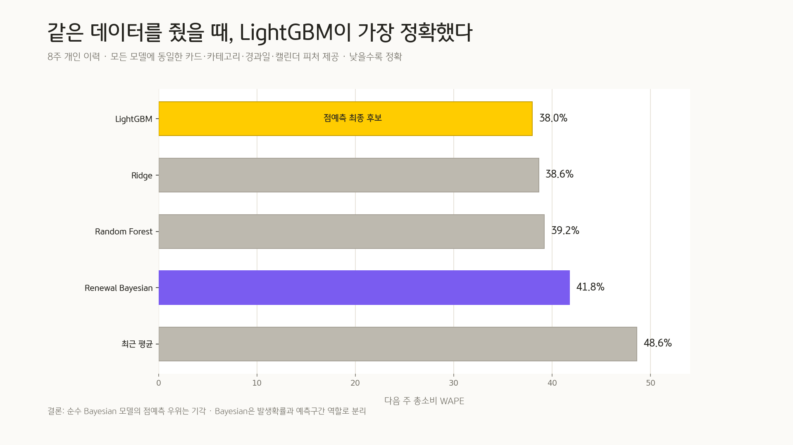

Nothing was adopted merely for being recent. [Chronos-2](#ref-chronos2) + calendar came in at WAPE
0.4351 — 14.6% worse than LightGBM — and no performance ceiling justifying distillation of a 120M-parameter
server model was found. A personal safety gate and wide conformal amount intervals were also shelved,
failing to clear hold-out improvement and practical width respectively.
[Conformalized Quantile Regression](#ref-cqr) on static data and
[Adaptive Conformal Inference](#ref-adaptive-conformal) for distribution shift remain candidates to
revisit in a real pilot.

Experiment design, confidence intervals, failure cases, and full reproduction paths are in the
**[consolidated forecasting experiment write-up](docs/tune-experiments-2026-07-30.md)** (Korean).

### Additional spendable amount · `WeekLedger` + `AppModel.weeklyBudget`

```
monthly allocatable  = monthly income − fixed costs − savings goal − next-month instalment carryover
week base share      = monthly allocatable × (days that week contributes to this month ÷ days in month)
week actual share    = week base share + last week's carryover
spendable this week  = max(0, max(0, week actual share) × direction factor − this week's event costs)
carryover to next    = week actual share − this week's event costs
```

The first and last weeks of a month have fewer days, so they get proportionally less.
The 1–2 won left over from division are pushed into the final week so the monthly total stays exact.
If you overspent last week, that negative carries over too — otherwise the overage would simply vanish.

| Direction | Weekly factor | Off-calendar small-spend factor |
|---|:--:|:--:|
| 🔵 Reduce | `0.86` | `0.60` |
| ⚪ Maintain | `1.00` | `1.00` |
| 🟠 Increase | `1.18` | `1.35` |

### Goal probability · `BudgetEngine.probability`

Start from the mean remaining spend: committed future events plus off-calendar small spending.

$$
\mu=\sum_j a_j
+7{,}500\times d_{left}\times f_{direction}
$$

Uncertainty no longer uses a fixed $\sigma=100{,}000$ won. It combines amount error on committed
events with rate error on off-calendar spending, so it widens with more events and a longer run to
month end.

$$
\sigma^2=
\sum_j a_j^2\left(e^{s^2}-1\right)
+E[X]^2\left(t e^{s^2}+t^2CV_\lambda^2\right)
$$

Current values are $s=0.40$, an off-calendar rate of 1 event/day, and $CV_\lambda=1.0$.
With remaining budget $R$, the goal probability is:

$$
p_{goal}=\min\left(0.97,\Phi\left(\frac{R-\mu}{\sigma}\right)\right)
$$

iOS computes the normal CDF in closed form; the backend runs 20,000 Monte Carlo draws from the same
mean and variance. The two implementations must agree within ±1pp in tests. The 97% cap exists so the
app never says "certain" while ignoring sudden large payments the model can't capture.

### Recurring spending patterns · `SpendHistory` + `SpendModel`

A name appearing twice or more counts as "recurring spending".
The app computes how many days apart, how regular, and how much is typical.

```
regularity = clamp(1 − (cycle deviation ÷ mean cycle) ÷ 0.5,  0,  1)
```

The steadier the cycle, the closer to 1.
For regular spending, the rationale leads with **"you tend to do this every N weeks"** rather than the amount.

| Pattern | Cycle | Mean amount | Regularity |
|---|---|---:|---:|
| Ward | 42 days (6 weeks) | 40,000 won | `1.00` |
| Coupang groceries | 10 days | 35,000 won | `0.93` |
| Weekend date | 14 days (2 weeks) | 70,000 won | `1.00` |
| Barber | 49 days (7 weeks) | 26,000 won | `1.00` |
| Café | 2 samples | median 20,000 won | sample count and observed range shown |

`SpendModel` uses a Gamma–Poisson rate, log-normal amounts, and Weibull intervals to produce occurrence
probabilities and 80% intervals. That said, no effect where this on-device Bayesian state
automatically improves *other* categories over the long run was confirmed on the fresh hold-out.
It is therefore used only for pattern-card explanations, intervals, and shadow-mode validation — and
is not presented as having the Tune score's validated accuracy.

### Amounts for people with no history · `BaselinePrices`

A first-time user has no spending history. An amount still has to appear.
Rather than inventing one, **it comes from public statistics.**

Amounts are chosen in order of how close they are to this specific person:

```
1. What this person actually spent on the same event      ← most accurate
2. This person's payments in the same category, 2+ samples ← median
3. Public statistics reference price                       ← when there's no history
4. Web search                                              ← only when enabled; travel and similar
5. Hard-coded rule fallback
```

Step 3 draws on three sources, and each row carries a source and reference date that is quoted
verbatim on screen.

| Source | What | Update |
|---|---|---|
| Korea Consumer Agency *Chamgagyeok* | Per-portion prices for 8 dining items; salon, bathhouse, laundry rates (16 regions) | Monthly |
| Statistics Korea Household Income and Expenditure Survey | Monthly average spending across 12 categories, single-person households | Quarterly |
| Seoul Open Data Plaza commercial-district analysis | **Per-transaction** card amounts by industry and age band (25 Seoul districts) | Quarterly |

> 💬 Based on the average single card payment at pubs and casual bars.
> People in their 20s spend 0.81× the average in that industry, so that's applied.
> Source: Seoul Open Data Plaza commercial-district card sales (2026 Q1, 25 Seoul districts).

**Age band is optional.** Skip it in onboarding and the all-ages average is used.
Provide it and the payment multiplier for that band is applied — 20s and 50s differ considerably even
in the same industry. This value stays on the device and is never sent to the server.

**There are no reference values for wedding gift money or study-group fees.** No published statistic
corresponds to them. Venue rental fees or book purchases are a different behaviour from what you spend
at that event, so nothing was force-fitted.

For the same reason, **academy tuition (320,000 won) and gym memberships (190,000 won) were excluded.**
You pay once and use it for months, so attaching that to an event like "go to class" would be badly
wrong. Only industries where one payment equals one visit are included.

**Travel is priced as one night's accommodation only.** Transport and food swing by multiples depending
on nights and party size, so pricing "one trip" whole from public statistics is impossible. Travel
therefore routes to web search (step 4 above) when enabled.

The table is **fetched whole, kept on the device, and queried on the device.**
Asking the server per title would put event titles on the wire.

### Event tagging

Each event carries two tags:

- **Payment industry** — what it was spent on (dining, café, transport…)
- **Life purpose** — why it was spent (date, study, get-together…)

Knowing a card was swiped at Starbucks doesn't tell you whether it was a date or a study session.
The Analysis screen combines both to separate necessary spending from the rest.

<br/>

<a id="principles"></a>

## 📐 Design principles

**Numbers from code, sentences from the LLM**
Spendable amount, goal probability, and benefit calculations come from deterministic engines
(`BudgetEngine`, `RecoEngine`, `SpendHistory`). The LLM speaks **only within the data it was given**.
Adding or comparing given values is allowed; producing a value that doesn't exist is not.
`app/eval/groundedness.py` enforces that boundary.

```
allowed   12,000 won + 8,000 won = 20,000 won   ← arithmetic on given data
allowed   118,500 won as "about 120,000 won"    ← rounding
blocked   125,000 won                           ← appears nowhere
```

When an ungrounded number is found, **`(check needed)` is appended to that number only.**
Discarding the whole answer would take the correct sentences with it.
At three or more, most of the answer is fabricated, so it's replaced with a deterministic template.
Whether annotated or replaced, **it still counts as a model failure in the evaluation score** —
safe fallbacks and model quality are not packaged together as the same 100%.

**It runs without the server**
`BudgetEngine` is a direct Swift port of the backend `app/engine`.
With the server down, the same numbers come out. The server only makes the sentences read better.

**It doesn't promise outcomes**
Credit cards get "this requires approval", not "you will be issued this card."
Products past their application window never get "you can sign up."
It never tells you to spend more to hit a card's spending threshold.

<br/>

<a id="guideline"></a>

## 📋 Relation to public guidelines

Reviewed against the Personal Information Protection Commission's
**"Guide to Processing Publicly Available Personal Data for AI Development and Services"**
(July 2024, supported by KISA).

### Most of it doesn't apply — and that's the point

The guide's stated scope is **datasets gathered by web scraping that contain personal data, used to
train AI.**

| The guide's premise | KB Tune |
|---|---|
| Data is collected from the web | ✅ `tools/fetch_baseline.py` |
| **The collected material contains personal data** | ❌ What's fetched are **published statistical aggregates** — item average prices, monthly category averages, **per-transaction** industry averages. No individuals. |
| **A model is trained on that data** | ❌ No training, no fine-tuning. Only inference against an already-built model. |
| User-entered text is used for training | ❌ It is not |

So the guide's core — **Chapter II, on whether training data may be processed under legitimate
interest — does not apply at all.** Memorisation and regurgitation, re-identification, the inability
to delete a specific person's data from a trained model: the risks the guide addresses
**cannot structurally arise here**, because nothing is trained.

### The measures that do apply are already in the code

These are the service-stage items.

| Guide | Implementation |
|---|---|
| **III-1-1** Honour the robots exclusion standard | [`fetch_baseline.py`](backend/tools/fetch_baseline.py) — checks `robots.txt` before fetching and stops if disallowed |
| **III-1-2** Remove and de-identify personal identifiers<br/><sub>unique identifiers, sensitive data, account and card numbers</sub> | [`OutboundPrivacy.sanitize()`](KB_Tune/AgentService.swift) + server-side [`redact_personal_data()`](backend/app/security.py) — nearly identical to the guide's example list |
| **III-1-3** Secure storage and management | Device files use `completeFileProtection`, excluded from backup |
| **III-1-5** Prompt filtering | [`safe_text()`](backend/app/security.py) — strips control characters and pins user input as *data* |
| **IV** Right to request deletion | `ConsentStore.reset()` · `LocalStore.clear()` — consent and device state clear immediately |

> Details are in [docs/security.md](docs/security.md) (Korean). The guide is an interpretive standard without legal force.

<br/>

<a id="stack"></a>

## 🛠 Tech stack

| Area | Technology |
|---|---|
| 📱 iOS | Swift · SwiftUI (iOS 26.5) · EventKit · Vision (on-device OCR) · PhotosUI |
| ⚙️ Backend | Python · FastAPI · Uvicorn · httpx |
| 🤖 LLM | OpenAI API · OpenAI-compatible local model · offline templates |
| ✅ Testing | pytest · Swift Testing · XCUITest |

The LLM is selected with `LLM_BACKEND`: `offline` (templates, zero cost) · `local` (OpenAI-compatible,
zero cost) · `openai`. Whichever is chosen, failure falls back to templates.

<br/>

<a id="structure"></a>

## 📂 File layout

```
KB_Tune/                      iOS app (SwiftUI, iOS 26.5)
├─ Models.swift               AppModel — single source of truth for calendar, budget, forecast state + SpendState
├─ BudgetEngine.swift         Spendable amount and goal probability (Swift port of the backend engine)
├─ WeekLedger.swift           Per-week ledger — day-count allocation → last week's carryover → this week's room
├─ MatchEngine.swift          Links card payments to calendar events (only on computable criteria)
├─ SpendHistory.swift         History → recurring pattern detection → amount forecast + rationale text
├─ SpendModel.swift           Gamma–Poisson · log-normal · Weibull on-device pattern model
├─ ForecastEngine.swift       On-device inference over LightGBM · q75 · Hazard neutral trees
├─ ForecastModels.json        Model and feature versions, population priors, calibration coefficients (no raw transactions)
├─ TuneScore.swift            Tune score and confidence, combining goal, balance and protected spending
├─ RiskDetector.swift         Proactive alerts on score drops, low balance, event/payment collisions
├─ AdjustmentEngine.swift     Compares recommended, alternative and excluded proposals under protection constraints
├─ TuneAudit.swift            Audit log of rationale, user approval and model version
├─ TuneScoreView.swift        Tune score detail, proposals, rationale and audit record screen
├─ EventEstimator.swift       Event title → expected spend (history → public stats → rules)
├─ BaselinePrices.swift       Public-statistics reference prices (bundled copy + server refresh)
├─ SearchQuery.swift          Event title → search query (assembled only from words in the code)
├─ baseline_prices.json       Reference price table from Chamgagyeok, HIES and commercial-district analysis
├─ RecoEngine.swift           Deterministic product recommendation (age/threshold hard filters → net benefit)
├─ Products.swift             KB product catalogue (based on spec v2)
├─ ContentView.swift          Entry flow (splash → onboarding → main tabs)
├─ MainTabView.swift          Bottom 4 tabs · swipe navigation · reset on Weekly re-tap
├─ WeeklyPlanView.swift       Weekly and monthly plan, timetable, Tune score, expected spend, risk adjustment
├─ ChatbotView.swift          Chat (backend streaming + local fallback)
├─ AnalysisView.swift         Essential/other breakdown · spent vs upcoming colour split · capture upload
├─ ProductsView.swift         Cash-flow summary → card and savings comparison
├─ AddEventView.swift         Add event in 3 steps (input → estimate and impact → confirm)
├─ OnboardingView.swift       Onboarding (connect calendar → income and goal → preferences → direction)
├─ Consent.swift              Storage and withdrawal of the 3 consents (Art. 15, 23, 28-8)
├─ ConsentView.swift          Consent screen (full text uncollapsed, each item taken separately)
├─ SettingsView.swift         Edit income, savings goal, preferences
├─ CalendarStore.swift        Real EventKit integration (reads the device calendar)
├─ AgentService.swift         Question → financial intent · passes past spend/events without titles
├─ EventPhrase.swift          Extracts dates and amounts from natural language (on device)
├─ LocalStore.swift           Device storage (complete protection · excluded from backup)
├─ SpeechService.swift        On-device speech recognition (nothing sent to a server)
├─ OCRService.swift           On-device Vision OCR + transaction structuring
├─ DemoClock.swift            Demo calendar reference date (serial day numbering from 7/1 = 1)
└─ DesignSystem.swift         KB colour tokens · shared styles · amount formatting

backend/                      FastAPI (optional — the app works without it)
├─ app/engine/                Deterministic engine (plan, estimate, classify, forecast, probability)
├─ app/llm/                   OpenAI and local model calls (explanation, conversation)
├─ app/eval/                  Golden cases + groundedness checking
├─ app/security.py            Request auth, rate limiting, PII masking, prompt-injection defence
├─ app/baseline.py            Public-statistics reference prices (Firestore → bundled fallback)
├─ app/llm/search.py          Finding amounts by web search (only with consent)
├─ data/baseline_prices.json  Reference price table (same file as the app bundle)
├─ tools/fetch_baseline.py    3 public data sources → regenerate the reference price table
├─ tools/seed_baseline.py     Reference price table → Firestore
└─ app/data.py                Demo inputs (profile, fixed costs, events)

tools/forecast_bench/         Reproduction experiments: model comparison, feedback, personalization, risk, Hazard
├─ export_ondevice_models.py  Generates selected-model JSON and Python↔Swift golden cases
└─ results/                   Raw forecasts, summary CSVs, bootstrap CIs, KB-styled charts
```

<br/>

<a id="run"></a>

## ▶️ Running it

**iOS**
```bash
open KB_Tune.xcodeproj      # Xcode 26.6+, iOS 26.5 simulator
```
`KB_Tune/` is a file-system-synchronized group. Dropping in a `.swift` file includes it in the build automatically.

**Backend** (optional)
```bash
cd backend
pip install -r requirements.txt
cp .env.example .env         # defaults to LLM_BACKEND=offline — runs on templates with no key
uvicorn app.main:app --reload
```

**Tests**
```bash
cd backend && PYTHONPATH=. .venv/bin/python -m pytest -q
xcodebuild test -project KB_Tune.xcodeproj -scheme KB_Tune \
  -destination 'platform=iOS Simulator,name=iPhone 17 Pro'
```

`KB_TuneTests/ForecastModelTests.swift` separately guards that the Python golden cases and the Swift
tree inference agree on median, q75, Hazard probability, and expected date.

The default suite runs with no key and no network. Documentation captures are gated separately.

```bash
# Re-capture 12 screens into docs/screens/ (on-device-only mode — no network needed)
TEST_RUNNER_KB_TUNE_CAPTURE_ALL=1 \
TEST_RUNNER_KB_TUNE_SCREENSHOT_DIR=$PWD/docs/screens \
  xcodebuild test -scheme KB_Tune -destination 'platform=iOS Simulator,name=iPhone 17 Pro' \
  -only-testing:KB_TuneUITests/KB_TuneUITests/testCaptureAllScreens \
  -only-testing:KB_TuneUITests/KB_TuneUITests/testCaptureOnboarding
```

The App Store screenshots above (`docs/appstore/`) are built from these captures in a separate editor.
The submission originals are eight 6.9" (1320×2868) images; the README embeds width-reduced copies only.

Chat captures that hit the real backend need the server running.

```bash
cd backend && ./run.sh       # bring the backend up first
# XCUITest only forwards variables prefixed with TEST_RUNNER_ to the test runner.
TEST_RUNNER_KB_TUNE_LIVE_CHAT=1 \
TEST_RUNNER_KB_TUNE_SCREENSHOT_DIR=$PWD/../docs/screens \
  xcodebuild test -scheme KB_Tune -destination 'platform=iOS Simulator,name=iPhone 17 Pro' \
  -only-testing:KB_TuneUITests/KB_TuneUITests/testLiveChatAnswersPastSpendingScreenshot
```

<br/>

## 🗺 What's next

| Stage | Timeline | Implementation and validation goal | Completion criteria |
|:--:|---|---|---|
| 1 | Done | Regression on Tune score, protection constraints, proactive alerts, audit log | State restored on relaunch · 0 unapproved executions · 0 protected-spending violations |
| 2 | 12 weeks | 20–50 user shadow-mode chronological pilot | Publish WAPE, bias, Brier, ECE, date MAE, ±1 day hit rate |
| 3 | Integrated, not yet measured | On-device inference for calibrated LightGBM, q75, Hazard | Python↔Swift golden match done · on-device latency and battery still to be measured |
| 4 | Post-pilot | Re-decide whether to promote cumulative Bayesian | Unqueried WAPE improvement 95% CI lower bound > 0, passing at both 8 and 12 weeks |
| 5 | Integration phase | KB Pay sandbox, token auth, consent withdrawal | No raw storage · withdrawal effective immediately · threat model review |

<br/>

## 📚 References

> These works are the **methodological basis** for the model structures and evaluation metrics.
> KB Tune's model choices and performance figures are not taken from the papers — they are results from
> same-data comparisons and fresh-seed hold-out experiments in this repository. Synthetic-data results
> are therefore not interpreted as real customer performance.

1. <a id="ref-lightgbm"></a>Ke, G. et al. (2017).
   [*LightGBM: A Highly Efficient Gradient Boosting Decision Tree*](https://proceedings.neurips.cc/paper_files/paper/2017/hash/6449f44a102fde848669bdd9eb6b76fa-Abstract.html).
   Advances in Neural Information Processing Systems 30.
2. <a id="ref-quantile-regression"></a>Koenker, R. & Bassett, G. (1978).
   [*Regression Quantiles*](https://doi.org/10.2307/1913643).
   Econometrica, 46(1), 33–50.
3. <a id="ref-discrete-survival"></a>Gensheimer, M. F. & Narasimhan, B. (2019).
   [*A Scalable Discrete-Time Survival Model for Neural Networks*](https://doi.org/10.7717/peerj.6257).
   PeerJ, 7:e6257.
4. <a id="ref-weibull"></a>Weibull, W. (1951).
   [*A Statistical Distribution Function of Wide Applicability*](https://doi.org/10.1115/1.4010337).
   Journal of Applied Mechanics, 18(3), 293–297.
5. <a id="ref-brier"></a>Brier, G. W. (1950).
   [*Verification of Forecasts Expressed in Terms of Probability*](https://doi.org/10.1175/1520-0493(1950)078%3C0001:VOFEIT%3E2.0.CO;2).
   Monthly Weather Review, 78(1), 1–3.
6. <a id="ref-pr-curve"></a>Davis, J. & Goadrich, M. (2006).
   [*The Relationship Between Precision-Recall and ROC Curves*](https://doi.org/10.1145/1143844.1143874).
   Proceedings of the 23rd International Conference on Machine Learning, 233–240.
7. <a id="ref-cqr"></a>Romano, Y., Patterson, E. & Candès, E. J. (2019).
   [*Conformalized Quantile Regression*](https://proceedings.neurips.cc/paper_files/paper/2019/hash/5103c3584b063c431bd1268e9b5e76fb-Abstract.html).
   Advances in Neural Information Processing Systems 32.
8. <a id="ref-adaptive-conformal"></a>Gibbs, I. & Candès, E. J. (2021).
   [*Adaptive Conformal Inference Under Distribution Shift*](https://proceedings.neurips.cc/paper/2021/hash/0d441de75945e5acbc865406fc9a2559-Abstract.html).
   Advances in Neural Information Processing Systems 34.
9. <a id="ref-chronos2"></a>Ansari, A. F. et al. (2025).
   [*Chronos-2: From Univariate to Universal Forecasting*](https://arxiv.org/abs/2510.15821).
   arXiv:2510.15821.

<br/>

<div align="center">
<sub>KB AI Challenge 2026 · for internal review</sub>
</div>
