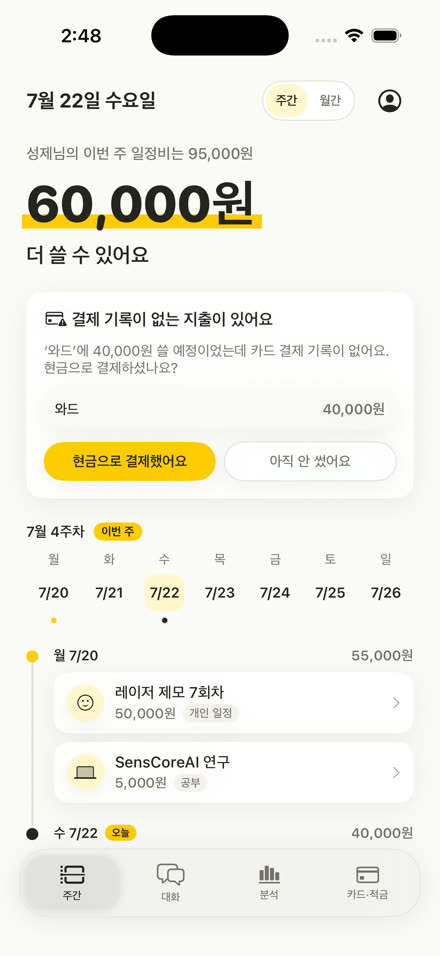
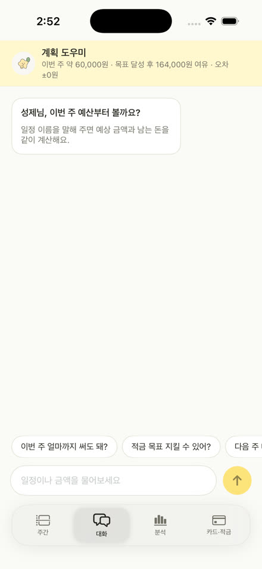
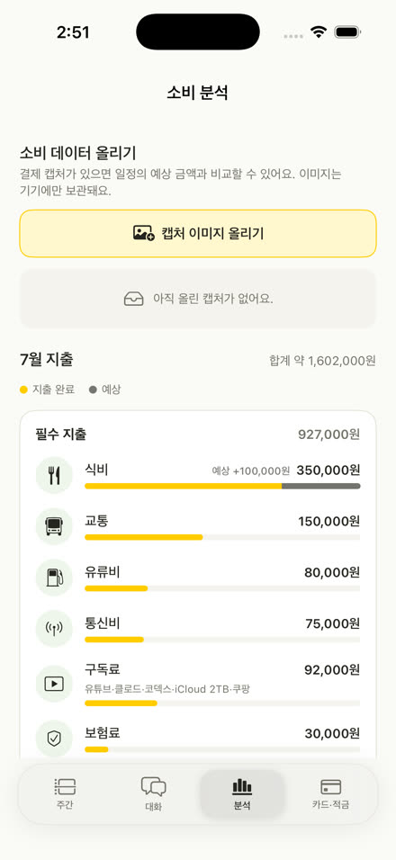
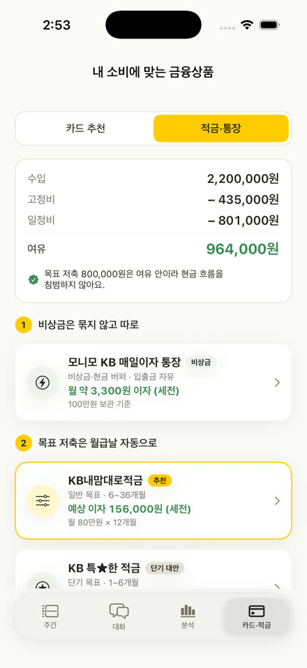
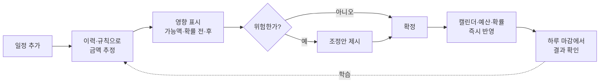

<div align="center">


# KB Tune

### 캘린더를 보면, 이번 주에 쓸 수 있는 돈이 나와요

가계부는 쓴 돈을 기록해요.<br/>
**KB Tune은 아직 안 쓴 돈을 다뤄요.**

<br/>


<br/><br/>






<sub>주간 계획 · 대화 · 소비 분석 · 카드·적금</sub>

</div>

<br/>

캘린더 약속과 과거 소비에서 앞으로 나갈 돈을 먼저 계산해요.
그리고 남는 금액을 알려드려요. 계획이 흔들릴 것 같으면 무엇을 옮길지 제안해요.

<br/>

<table>
<tr>
<td width="50%" valign="top">

**📖 &nbsp;[사용 안내](#user-guide)**

앱이 뭘 하는지, 어떻게 쓰는지

- [왜 만들었나요](#why)
- [처음 켜면](#getting-started)
- [화면 넷](#screens)
- [돈의 세 가지 상태](#money-states)
- [하루 마감](#daily-close)
- [자주 묻는 것](#faq)

</td>
<td width="50%" valign="top">

**💻 &nbsp;[개발자용 문서](#dev-docs)**

어떻게 계산하고 어떻게 만들었는지

- [핵심 루프](#core-loop)
- [알고리즘](#algorithms)
- [설계 원칙](#principles)
- [기술 스택](#stack)
- [파일 구조](#structure)
- [실행](#run)

</td>
</tr>
</table>

<br/>

---

<a id="user-guide"></a>

# 📖 사용 안내

<a id="why"></a>

## 🤔 왜 만들었나요

"이번 달 식비 30만원."
이런 예산은 잘 안 지켜져요. 지금 잡은 약속이 그 30만원에서 얼마를 가져가는지 모르니까요.

KB Tune은 약속 하나하나에 금액을 붙여요.
그래서 예산이 이렇게 바뀌어요.

```diff
- 식비 30만원
+ 이번 주 확정 지출 40,000원, 남은 60,000원
```

## 🤝 세 가지는 꼭 지켜요

**이유 없이 숫자를 줄이지 않아요**
금액에는 항상 근거를 붙여요.

> 💬 성제님의 와드 주기는 6주 정도였어요.
> 5월 16일 42,000원 · 6월 27일 38,000원

**줄이라고 말하지 않아요**
"더 필요한 소비"로 고르신 항목은 조정안에서 빼요. 아낄 곳은 그 바깥에서 찾아요.

**상품을 먼저 권하지 않아요**
카드·적금은 계획을 다 세운 뒤에 나와요. 그전에 현금흐름부터 보여드려요.

<br/>

<a id="getting-started"></a>

## 🚀 처음 켜면

|  | 단계 | 하는 일 |
|:--:|---|---|
| 1️⃣ | **온보딩** | 캘린더 연결 → 수입·저축 목표 → 좋아하는 것 → 소비 방향<br/>좋아하는 것으로 고르신 항목이 "건드리지 않을 소비"가 돼요 |
| 2️⃣ | **이번 주 쓸 돈 보기** | 앱을 열면 결론이 먼저 나와요<br/>고정비·저축 목표·확정 일정을 다 빼고 남은 금액이에요 |
| 3️⃣ | **일정 넣어보기** | 제목만 적어도 과거 이력에서 금액을 찾아 채워드려요<br/>확정 전에 "이걸 넣으면 얼마가 남는지" 먼저 보여드려요 |
| 4️⃣ | **하루 끝나면 확인** | 확인할 게 있는 날에만 물어봐요<br/>여기 답하시면 다음 예측이 정확해져요 |
| 5️⃣ | **어디에 쓰는지 보기** | 필수·기타로 나눠서, 쓴 돈과 나갈 돈을 색으로 구분해 드려요 |

<br/>

<a id="screens"></a>

## 📱 화면 넷

| 탭 | 하는 일 |
|---|---|
| 🗓️ **주간** | 이번 주 쓸 수 있는 금액 · 일정별 지출 · 하루 마감 · 예상 소비 · 월간 캘린더 |
| 💬 **대화** | 계획을 묻고 답해요. 일정을 말하면 금액과 남는 돈을 같이 계산해 드려요 |
| 📊 **분석** | 한 달 지출을 필수 / 기타로 나눠 봐요. 쓴 돈과 나갈 돈은 색으로 구분해요 |
| 💳 **카드·적금** | 여유부터 확인하고, 그다음에 상품을 비교해요 |

설정은 주간 화면 오른쪽 위 프로필 아이콘에 있어요.
탭은 좌우로 밀어서도 넘어가요. 주간 탭 안쪽에서 **주간을 한 번 더 누르면** 처음 화면으로 돌아와요.

<br/>

<a id="money-states"></a>

## 🎨 돈의 세 가지 상태

한 덩어리로 보여드리면 이미 나간 돈인지 나갈 돈인지 알 수 없어요.
그래서 셋으로 나눠요.

| 상태 | 뜻 | 화면에서 |
|---|---|---|
| 🟡 **확정 지출** | 이미 썼거나 반드시 나갈 돈 | 분석에서 **노란색** |
| 🕐 **예약 예산** | 일정에 잡아뒀지만 아직 결제 전 | **예약** 배지 |
| ⬛ **패턴 예상** | 캘린더엔 없지만 주기가 돌아온 지출 | 분석에서 **짙은 회색** |

> [!IMPORTANT]
> **예약은 실제 출금이 아니에요.**
> 계좌에서 돈이 나가지 않아요. 쓸 수 있는 금액에서만 빠져요.
>
> *"8월 2일 데이트 비용으로 100,000원을 8월 계획 예산에 예약할까요? 실제 출금은 없어요."*

<br/>

<a id="daily-close"></a>

## 🌙 하루 마감

예측만 하고 맞았는지 확인하지 않으면, 앱이 배울 게 없어요.
그래서 하루가 끝나면 물어봐요. **확인할 게 있는 날에만요.**

KB Pay가 연결되면 카드로 쓰신 건 앱이 이미 알아요.
그래서 아는 건 묻지 않아요. **카드 기록이 없는 지출**만 여쭤봐요.

```
💳 결제 기록이 없는 지출이 있어요

'와드'에 40,000원 쓸 예정이었는데 카드 결제 기록이 없어요.
현금으로 결제하셨나요?

[ 현금으로 결제했어요 ]   [ 아직 안 썼어요 ]
```

답하시면 예약이 확정으로 바뀌어요. 그게 다음 예측의 근거가 돼요.

<br/>

## 🔮 예상 소비

캘린더엔 없지만 주기적으로 나가는 돈이 있어요. 미리 알려드려요.

```
🛒 쿠팡 장보기          7/23 즈음   예상 35,000원

   성제님의 쿠팡 장보기 주기는 10일 정도였어요.
   6월 23일 34,000원 · 7월 3일 36,000원 · 7월 13일 35,000원

   [ 계획에 넣기 ]   [ 이번엔 안 써요 ]
```

> [!NOTE]
> **이 금액은 예산에서 미리 빼지 않아요.**
> "계획에 넣기"를 누르셔야 반영돼요. 모르는 사이에 남은 돈이 줄면 안 되니까요.

<br/>

<a id="faq"></a>

## ❓ 자주 묻는 것

<details>
<summary><b>예약하면 돈이 빠져나가나요?</b></summary>
<br/>

아니에요. 계좌는 그대로예요. "쓸 수 있는 금액"에서만 빠져요.

</details>

<details>
<summary><b>예상 소비는 왜 남은 돈에서 안 빠지나요?</b></summary>
<br/>

확정이 아니라서요. "계획에 넣기"를 누르셔야 들어가요.

</details>

<details>
<summary><b>일정을 취소하면 돈이 돌아오나요?</b></summary>
<br/>

지금은 "다음 주로 옮기기"로 이번 주 부담을 덜 수 있어요.
환불 확정분만 회수하는 기능은 다음에 만들어요.

</details>

<details>
<summary><b>"예상"이 붙은 금액은 뭔가요?</b></summary>
<br/>

추정치예요. 확인된 금액에는 "예상"을 붙이지 않아요.

</details>

<br/>

---
---

<a id="dev-docs"></a>

# 💻 개발자용 문서

<a id="core-loop"></a>

## 🔁 핵심 루프



숫자가 실제로 움직여요. 일정을 추가하면 히어로 금액이 내려가요.
예산을 넘기면 그 일정에 경고가 붙어요. "다음 주로 옮기기"를 누르면 일정이 이동하고
이번 주 사용 가능액이 회복돼요.

<br/>

<a id="algorithms"></a>

## 🧮 알고리즘

### 안전 사용 가능액 · `BudgetEngine.weeklyAvailable`

```
가처분     = 월 수입 − 고정비 − 저축 목표
남은 예산   = 가처분 − 이번 달 지금까지 쓴 일정비
주간 가능액 = max(0, 남은 예산 ÷ 남은 주 수 × 방향계수 − 이번 주 확정 지출)
```

남은 주 수는 `ceil((월 일수 − 오늘 + 1) / 7)`이에요. 방향계수는 사용자가 고른 소비 방향에서 와요.

| 방향 | 주간 계수 | 일정 밖 소액 계수 |
|---|:--:|:--:|
| 🔵 줄이기 | `0.86` | `0.60` |
| ⚪ 유지 | `1.00` | `1.00` |
| 🟠 늘리기 | `1.18` | `1.35` |

### 목표 달성 확률 · `BudgetEngine.probability`

몬테카를로 대신 정규근사를 써요. 백엔드 시뮬레이션과 ±1%p 이내로 맞아요.

```
μ    = 남은 확정 일정 + 일정 밖 소액(7,500원/일 × 남은 일수 × 방향계수)
z    = (남은 예산 − μ) / σ        σ = 100,000
확률  = Φ(z)                      Φ = 표준정규 누적분포
```

### 반복 소비 패턴 · `SpendHistory`

같은 제목이 2건 이상이면 패턴으로 봐요. 평균 주기·편차·평균 금액을 구하고 규칙성을 0~1로 환산해요.

```
규칙성 = clamp(1 − (주기 편차 ÷ 평균 주기) ÷ 0.5,  0,  1)
```

편차가 주기의 20% 이내면 높게 나와요. 규칙적일수록 금액보다 **주기**를 근거로 내세워요.

| 패턴 | 주기 | 평균 금액 | 규칙성 |
|---|---|---:|---:|
| 와드 | 42일 (6주) | 40,000원 | `1.00` |
| 쿠팡 장보기 | 10일 | 35,000원 | `0.93` |
| 주말 데이트 | 14일 (2주) | 70,000원 | `1.00` |
| 미용실 | 49일 (7주) | 26,000원 | `1.00` |

### 일정 태깅

일정 하나에 태그를 둘 붙여요.

- **결제 업종** — 무엇에 썼나 (외식·카페·교통…)
- **생활 목적** — 왜 썼나 (데이트·공부·모임…)

스타벅스 결제만으로는 데이트인지 공부인지 알 수 없으니까요.
분석 화면은 이 둘을 합쳐 필수/기타로 묶어요.

<br/>

<a id="principles"></a>

## 📐 설계 원칙

**숫자는 코드가, 문장은 LLM이**
사용 가능액·달성 확률·혜택 계산은 결정론 엔진(`BudgetEngine`, `RecoEngine`, `SpendHistory`)이 해요.
LLM은 결과를 설명할 뿐 숫자를 만들지 않아요.
`app/eval/groundedness.py`가 엔진이 내지 않은 숫자를 잡아내요.

**백엔드 없이도 돌아가요**
`BudgetEngine`은 백엔드 `app/engine`의 Swift 포트예요.
서버나 API 키가 없어도 같은 숫자가 나와요. 백엔드는 정확도와 문장을 더할 뿐이에요.

**단정하지 않아요**
신용카드는 "발급 가능"이 아니라 심사 대상이라고 밝혀요.
신청기간이 끝난 상품에 "가입 가능"을 붙이지 않아요.
실적을 채우려고 소비를 늘리라고 권하지 않아요.

<br/>

<a id="stack"></a>

## 🛠 기술 스택

| 영역 | 사용 기술 |
|---|---|
| 📱 iOS | Swift · SwiftUI (iOS 26.5) · EventKit · Vision(기기 내 OCR) · PhotosUI |
| ⚙️ 백엔드 | Python · FastAPI · Uvicorn · httpx |
| 🤖 LLM | Anthropic Claude. 오프라인·로컬 모델로 전환 가능 |
| ✅ 테스트 | pytest · XCTest |

LLM은 `LLM_BACKEND`로 골라요. `offline`(템플릿, 비용 0) · `local`(OpenAI 호환) · `claude`.
무엇을 고르든 실패하면 템플릿으로 넘어가요.

<br/>

<a id="structure"></a>

## 📂 파일 구조

```
KB_Tune/                      iOS 앱 (SwiftUI, iOS 26.5)
├─ Models.swift               AppModel — 캘린더·예산·예측 상태의 단일 출처 + SpendState
├─ BudgetEngine.swift         사용 가능액·목표 확률 (백엔드 엔진의 Swift 포트)
├─ SpendHistory.swift         과거 이력 → 반복 패턴 탐지 → 금액 예측 + 근거 문장
├─ EventEstimator.swift       일정 제목 → 예상 지출 (이력 우선, 규칙 폴백)
├─ RecoEngine.swift           결정론 상품 추천 (연령·실적 하드필터 → 순혜택 계산)
├─ Products.swift             KB 상품 카탈로그 (기준서 v2 기반)
├─ ContentView.swift          진입 흐름 (스플래시 → 온보딩 → 메인 탭)
├─ MainTabView.swift          하단 4탭 · 스와이프 전환 · 주간 탭 재선택 시 초기화
├─ WeeklyPlanView.swift       주간·월간 계획, 타임테이블, 하루 마감, 예상 소비, 위험 조정
├─ ChatbotView.swift          대화 (백엔드 스트리밍 + 로컬 폴백)
├─ AnalysisView.swift         필수/기타 지출 분해 · 쓴 돈·나갈 돈 색 구분 · 캡처 업로드
├─ ProductsView.swift         현금흐름 요약 → 카드·적금 비교
├─ AddEventView.swift         일정 추가 3단계 (입력 → 추정·영향 → 확정)
├─ OnboardingView.swift       온보딩 (캘린더 연결 → 수입·목표 → 취향 → 방향)
├─ SettingsView.swift         수입·저축 목표·취향 수정
├─ CalendarStore.swift        EventKit 실연동 (기기 캘린더 읽기)
├─ AgentService.swift         백엔드 호출 (대화 스트리밍·추정·캡처 구조화)
├─ OCRService.swift           기기 내 Vision OCR
└─ DesignSystem.swift         KB 컬러 토큰 · 공용 스타일 · 금액 포맷

backend/                      FastAPI (선택 — 없어도 앱 동작)
├─ app/engine/                결정론 엔진 (계획·추정·분류·예측·확률)
├─ app/llm/                   Claude 호출 (설명·대화·비전 OCR)
├─ app/eval/                  골든 케이스 + groundedness 검사
└─ app/data.py                데모 입력 (프로필·고정비·일정)
```

<br/>

<a id="run"></a>

## ▶️ 실행

**iOS**
```bash
open KB_Tune.xcodeproj      # Xcode 26.6+, iOS 26.5 시뮬레이터
```
`KB_Tune/`는 file-system-synchronized group이에요. `.swift` 파일을 넣으면 자동으로 빌드에 포함돼요.

**백엔드** (선택)
```bash
cd backend
pip install -r requirements.txt
cp .env.example .env         # ANTHROPIC_API_KEY (없으면 규칙 기반으로만 동작)
uvicorn app.main:app --reload
```

**테스트**
```bash
cd backend && pytest -q      # 엔진 회귀 + AI 기능 (20개)
# iOS: Xcode에서 ⌘U
```

<br/>

## 📊 데모 데이터

2026년 7월 캘린더 기준이에요. 확인값과 데모 가정이 섞여 있고, 앱에서도 구분해서 표시해요.

| 구분 | 값 |
|---|---|
| ✅ 확인값 — 월 고정비 | 435,000원 (통신 7.5 · 교통 15 · 유류 6 · 구독 3 · 청약 10 · 보험 2만) |
| ✅ 확인값 — 단건 | 정장 15만 · 결혼식 7만 · 데이트 10만 · 제모 5만 · 와드 4만 |
| ✅ 확인값 — 출근 | **0원** (점심 무비용, 교통·유류는 고정비에 포함) |
| 🔸 가정 | 월 수입 220만 · 저축 목표 80만 · 일정 밖 소액 7,500원/일 |

여기서 나오는 값이에요.
7월 일정비 **801,000원** · 이번 주 사용 가능액 **62,000원**(화면에는 60,000원으로 반올림) · 목표 확률 **81%**.

> [!WARNING]
> 금액을 바꾸실 때는 **iOS `BudgetEngine` · 백엔드 `app/data.py` · 양쪽 테스트를 함께** 고쳐주세요.
> 세 곳이 같은 숫자를 보도록 테스트가 잠가 두었어요.

> [!NOTE]
> **분석 탭 숫자는 따로예요.**
> `AnalysisView`의 필수/기타 금액은 캘린더 합계가 아니라 페르소나의 한 달 실지출을 정리한 값이에요(약 1,602,000원).
> 일정비 801,000원과 일부러 따로 움직여요. 두 숫자가 다른 건 버그가 아니에요.

<br/>

## 🗺 다음 과제

| 우선 | 항목 | 내용 |
|:--:|---|---|
| 1 | **일정–거래 매칭** | 제목·시간·업종·장소에 가중치를 준 점수로 결제를 일정에 자동 연결 |
| 2 | **취소·환불 처리** | 취소 시 예약액 전체가 아니라 환불 확정분만 회수 |
| 3 | **예약 전후 영향** | 일정 추가 시 사용 가능액·목표 확률 변화를 비교 |
| 4 | **소비 우선순위** | 반드시 유지 / 가능하면 유지 / 조정 가능 3단계 |

<br/>

<div align="center">
<sub>KB AI Challenge 2026 · 내부 검토용</sub>
</div>
