<div align="center">


# KB Tune

### 일정만 넣으면, 이번 주에 얼마 쓸 수 있는지 알려드려요

가계부는 이미 쓴 돈만 보여줘요.<br/>
**KB Tune은 앞으로 쓸 돈을 미리 알려드려요.**

<br/>


<br/><br/>

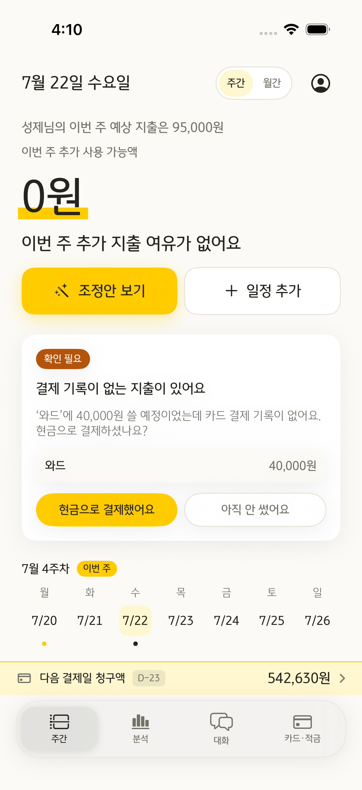
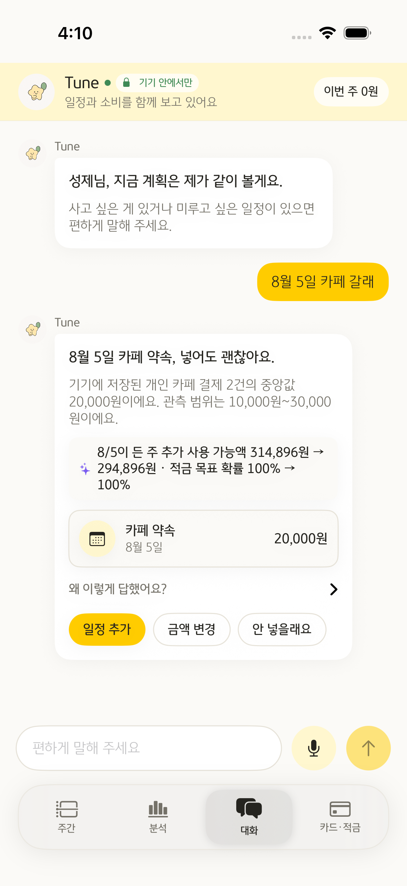
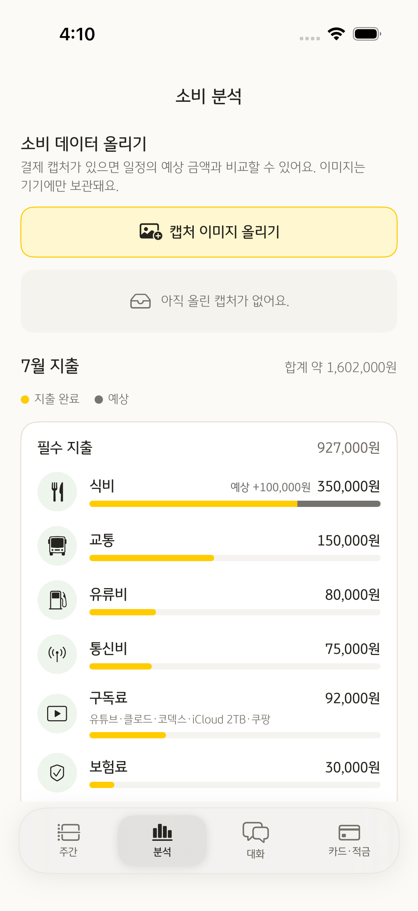
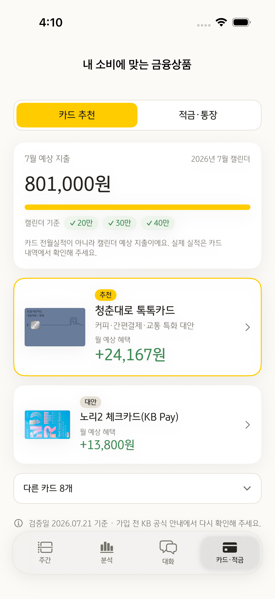

<sub>주간 계획 · 대화 · 소비 분석 · 카드·적금</sub>

</div>

<br/>

캘린더에 일정을 넣으면 과거에 비슷한 데 얼마 썼는지 찾아서 금액을 채워드려요.
저축 목표와 지난주에 남은 돈까지 계산해서, 이번 주에 더 쓸 수 있는 금액을 매번 다시 알려드려요.
<br/>일정이 늘어서 목표를 못 지킬 것 같으면, 어떤 걸 미루면 되는지 먼저 말씀드려요.

<br/>

<table>
<tr>
<td width="50%" valign="top">

**📖 &nbsp;[사용 안내](#user-guide)**

앱이 뭘 하는지, 어떻게 쓰는지

- [왜 만들었나요](#why)
- [처음 켜면](#getting-started)
- [화면 4개](#screens)
- [대화로 할 수 있는 일](#chat)
- [내 정보는 어디까지 나가나요](#privacy)
- [돈을 세 가지로 나눠요](#money-states)
- [하루 마감](#daily-close)
- [자주 묻는 질문](#faq)

</td>
<td width="50%" valign="top">

**💻 &nbsp;[개발자용 문서](#dev-docs)**

어떻게 계산하고 어떻게 만들었는지

- [핵심 루프](#core-loop)
- [대화는 이렇게 동작해요](#chat-flow)
- [알고리즘](#algorithms)
- [설계 원칙](#principles)
- [보안 설계](docs/security.md)
- [기술 스택](#stack)
- [파일 구조](#structure)
- [실행](#run)

</td>
</tr>
</table>

<br/>

---

<a id="user-guide"></a>

# 📖 사용 안내

<a id="why"></a>

## 🤔 왜 만들었나요?

> *"통장에 15만원 남았는데... 다음주 약속 나가면 얼마 남지?*
> *병원도 가야 하고, 옷도 사야 하는데..."*

머릿속으로 계산하면 잘 안 맞아요. 그러다 보면 저축은 늘 뒤로 밀려요.

가계부 앱들은 "식비 30만원"처럼 **덩어리로** 예산을 잡으라고 해요.
근데 우리는 식비로 사는 게 아니라, **약속 하나 병원 한 번**으로 돈을 써요.

그래서 KB Tune은 일정마다 금액을 붙여요.

```diff
- 식비 30만원          ← 얼마 남았는지 모르겠어요
+ 이번 주 40,000원 나가고, 60,000원 남아요
```

## 🤝 세 가지는 꼭 지켜요

**금액을 그냥 바꾸지 않아요**
왜 그 금액인지 항상 같이 알려드려요.

> 💬 성제님의 미용실(와드) 주기는 6주 정도였어요.
> 5월 16일 42,000원 · 6월 27일 38,000원

**줄이라고 하지 않아요**
"이건 포기 못 해"라고 고르신 건 건드리지 않아요. 아낄 곳은 나머지에서 찾아요.

**카드부터 팔지 않아요**
카드·적금은 계획을 다 세운 다음에 나와요. 돈이 어떻게 도는지부터 보여드려요.

<br/>

<a id="getting-started"></a>

## 🚀 처음 켜면

|  | 이걸 하면 | 이렇게 돼요 |
|:--:|---|---|
| 1️⃣ | **캘린더 연결하고 몇 개만 답하기** | 한 달 수입, 모으고 싶은 금액, 포기 못 하는 소비를 고르시면 끝이에요<br/>포기 못 한다고 고른 건 나중에도 안 건드려요 |
| 2️⃣ | **앱 열기** | 큰 숫자 하나가 먼저 보여요. 이번 주에 더 써도 되는 금액이에요<br/>월세·통신비·저축·이미 잡힌 약속을 다 빼고 남은 돈이에요 |
| 3️⃣ | **일정 하나 넣어보기** | 제목만 적어도 금액이 자동으로 채워져요<br/>넣기 전에 *"이거 넣으면 얼마 남는지"*부터 보여드려요 |
| 4️⃣ | **자기 전에 한 번 확인** | 카드 기록이 없는 지출만 물어봐요<br/>답해주시면 다음부터 더 정확해져요 |
| 5️⃣ | **주말에 분석 탭 보기** | 어디에 얼마 썼는지, 앞으로 얼마 나갈지 한눈에 보여요 |

<br/>

<a id="screens"></a>

## 📱 화면 4개

| 탭 | 여기서 뭘 하나요 |
|---|---|
| 🗓️ **주간** | 이번 주에 얼마 더 쓸 수 있는지 봐요<br/>일정별로 얼마 나갈지, 이번 달 전체는 어떤지도 같이 봐요 |
| 💬 **대화** | 말로 물어보고 말로 바꿔요<br/>*"이번 달 카페에 얼마 썼어?"* · *"8월 5일 카페 갈래"* · *"일정 하나 미뤄줘"* |
| 📊 **분석** | 어디에 얼마나 쓰는지 봐요<br/>이미 쓴 돈과 앞으로 나갈 돈을 색으로 나눠서 보여드려요 |
| 💳 **카드·적금** | 내 소비에 맞는 카드를 찾아요<br/>얼마나 이득인지 계산해서 순서대로 보여드려요 |

설정은 주간 화면 오른쪽 위 동그라미를 누르면 나와요.
탭은 좌우로 밀어도 넘어가요. 주간 탭에서 **주간을 한 번 더 누르면** 맨 위로 올라가요.

<details>
<summary><b>화면 더 보기 (12장)</b></summary>
<br/>

<div align="center">

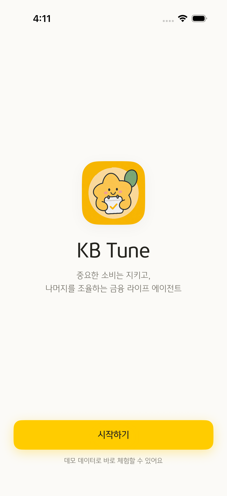

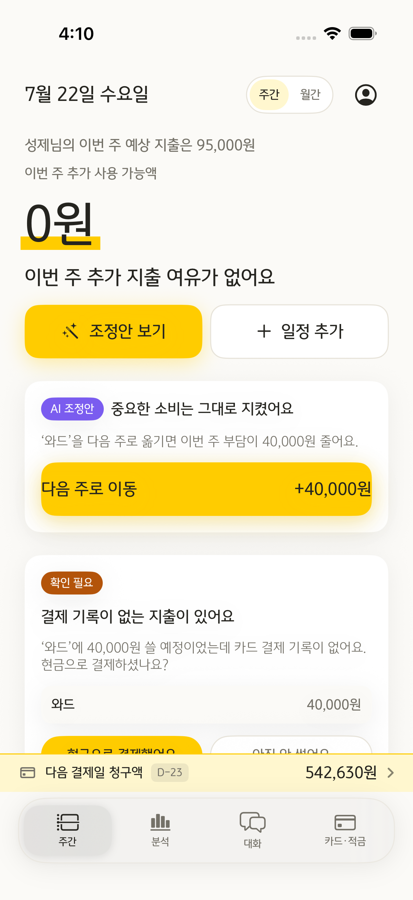
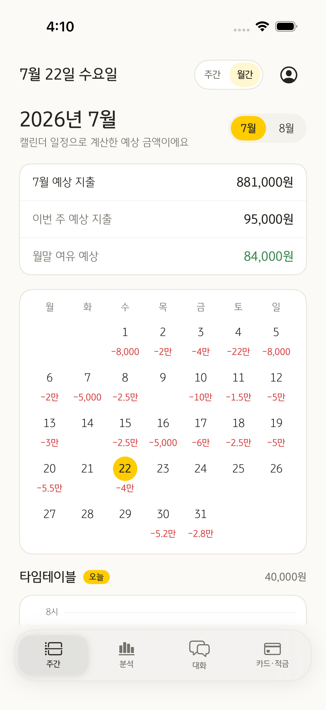

<sub>처음 켜면 · 이번 주 · 조정안 · 이번 달</sub>

<br/><br/>

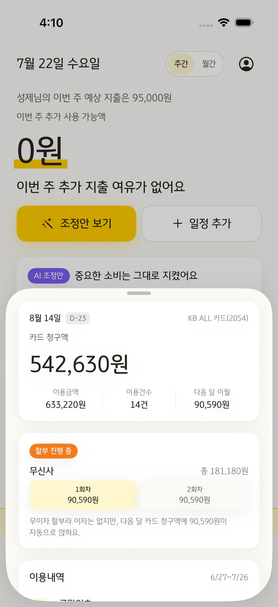
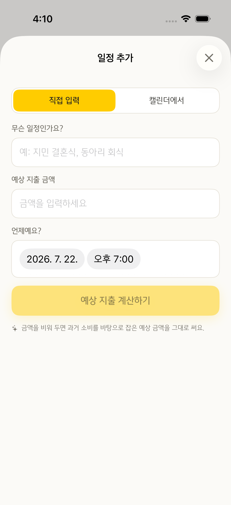
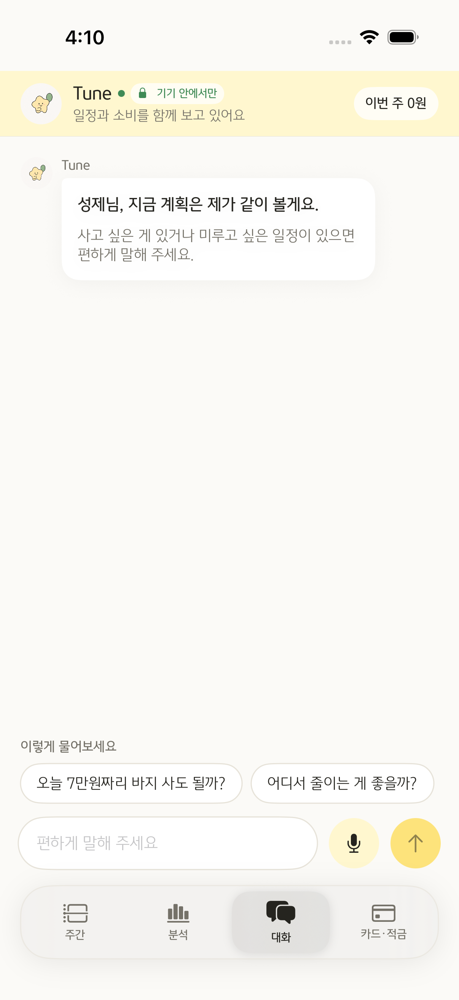


<sub>카드 청구 · 일정 추가 · 대화 · 일정 제안</sub>

<br/><br/>


<sub>분석 · 카드 추천</sub>

</div>

<br/>

이 화면들은 테스트가 자동으로 찍어요. 사람이 캡처해서 올리는 게 아니라,
`testCaptureAllScreens`가 앱을 켜서 탭을 돌며 찍기 때문에 화면이 바뀌면 스크린샷도 같이 바뀌어요.

</details>

<br/>

<a id="chat"></a>

## 💬 대화로 할 수 있는 일

보통 금융 앱 챗봇은 물어보면 "고객센터로 연결해 드릴까요?"라고 해요.
KB Tune은 **묻는 것도, 바꾸는 것도** 대화 안에서 끝나요.

### 뭘 물어볼 수 있나요

**1. 이미 쓴 돈**

```
나  이번 달 카페에 얼마 썼어?

☁️  카페는 오늘까지 20,000원 썼어요.
    7/3에 12,000원, 7/11에 8,000원 쓴 합계예요.
```

합계를 미리 만들어두고 답하는 게 아니에요. 그때그때 더해서 답해요.
그래서 "외식이랑 카페 중에 뭐가 더 많아?" 같은 것도 답할 수 있어요.

**2. 앞으로 써도 되는지**

```
나  오늘 7만원짜리 바지 사도 될까?

☁️  이번 주는 62,000원까지가 여유예요. 7만원이면 8,000원 넘어가요.

    금요일 약속을 다음 주로 미루면 52,000원이 돌아와서 괜찮아져요.

    [ 다음 주로 옮기기 ]  [ 그냥 살래요 ]
```

**3. 말로 일정 넣기**

```
나  8월 5일 카페 갈래

☁️  8월 5일 카페 약속, 넣어도 괜찮아요.
    기기에 저장된 카페 결제 2건의 중앙값 20,000원이에요.
    관측 범위는 10,000원~30,000원이에요.

    8/5이 든 주 추가 사용 가능액 314,896원 → 294,896원

    [ 일정 추가 ]  [ 금액 변경 ]  [ 안 넣을래요 ]
```

날짜(`8월 5일`)와 종류(`카페`)를 폰에서 알아들어요.
금액은 **내 과거 카페 결제**에서 가져와요. 평균이 아니라 중앙값을 써요 —
한 번 크게 쓴 게 있으면 평균이 확 올라가거든요.

### 말한 대로 바뀌어요

말풍선 안의 버튼을 누르면 진짜로 일정이 들어가고, 예산 숫자가 바로 움직여요.
기기 캘린더에도 같이 저장돼요.

| 버튼 | 누르면 |
|---|---|
| **일정 추가** | 캘린더에 들어가고, 이번 주 남은 금액이 그만큼 줄어요 |
| **다음 주로 옮기기** | 일정이 옮겨지고, 이번 주 금액이 돌아와요 |
| **금액 변경** | 제안한 금액을 직접 고칠 수 있어요 |
| **카드 보러 가기** | 내 소비에 맞는 카드 화면으로 넘어가요 |

### 숫자를 지어내지 않아요

이게 제일 중요해요. 금융 앱에서 AI가 숫자를 틀리면 안 되니까요.

**금액은 AI가 만들지 않아요.** 앱이 계산한 숫자만 AI에게 주고, AI는 그걸로 문장만 써요.
준 숫자끼리 더하거나 비교하는 건 되지만, 없는 숫자를 만들면 잡혀요.

```
✅  12,000원 + 8,000원 = 20,000원   ← 준 숫자로 계산
✅  118,500원을 "약 12만원"으로      ← 반올림
❌  125,000원                        ← 어디에도 없는 숫자
```

걸리면 그 숫자 옆에만 **(확인 필요)** 를 붙여요. 답 전체를 지우지 않아요.
틀린 숫자 하나 때문에 맞는 문장 세 개까지 사라지면 손해잖아요.
다만 세 개 넘게 틀리면 그냥 앱이 만든 문장으로 바꿔요.

### 길게 말하지 않아요

얼마 썼는지 물으면 한두 문장이면 끝이에요.
써도 되냐고 물을 때만 이유랑 방법을 붙여요.

말투도 손봤어요. 예전엔 이렇게 답했거든요.

```diff
- 이유는 이번 주 추가 사용 가능액이 62,000원이고, 이번 달 남은 예산은
- 204,000원이지만 앞으로 잡힌 일정 예상액이 801,000원이라 카페 예산을
- 넉넉하게 보기 어려워서예요.  (이런 문단이 4개)

+ 카페는 오늘까지 20,000원 썼어요. 7/3에 12,000원, 7/11에 8,000원 쓴 합계예요.
```

"이유는", "영향은", "행동 제안은"으로 문장을 시작하지 못하게 막았어요.
그렇게 쓰면 대화가 아니라 서류처럼 읽히거든요.

### 인터넷이 끊겨도

서버가 안 되면 폰 안에서 답해요. 대신 미리 준비한 답변만 나와요.
**중요한 건 그때도 숫자는 똑같다는 거예요.** 화면에 62,000원이 떠 있으면 대화도 62,000원이라고 해요.

### 말로도 돼요

마이크를 누르고 말하면 돼요. 음성 인식은 폰 안에서만 해요.
녹음 파일은 저장하지 않고, 애플 서버로도 안 보내요.

<br/>

<a id="privacy"></a>

## 🔒 내 정보는 어디까지 나가나요

**아무것도 안 나가는 게 기본값이에요.** 앱을 받아서 그냥 켜면 외부 AI를 한 번도 부르지 않아요.
예산 계산·일정 추가·금액 예측은 전부 폰 안에서 끝나요.

다만 **자유롭게 대화하려면 AI 모델이 필요해요.** 외부 AI 없이도 앱은 돌아가지만,
그때 대화는 미리 짜둔 답변만 나와요. 아무 말이나 물어보려면 대화 탭에서 직접 켜셔야 해요.

켜면 이만큼만 나가요.

| | 나가나요? |
|---|---|
| 이름 · 나이 | **안 나가요** — 서버에 받는 칸 자체를 안 만들었어요 |
| 내가 쓴 질문 그대로 | **안 나가요** — 폰에서 `카페 지출 질문` 같은 형태로 바꿔서 보내요 |
| 웹 검색을 켰을 때 보낸 문장 | 켜면 그 문장 그대로 나가요 — 아래 설명을 봐주세요 |
| **일정 제목** | **안 나가요** — 켜고 끄는 선택지조차 두지 않았어요 |
| 영수증 캡처 · 거기서 읽은 글자 | **안 나가요** — 폰 안에서 읽어요 |
| 음성 | **안 나가요** — 폰 안에서만 인식해요 |
| 날짜 · 유형 · 금액, 예산 숫자 | 켜면 나가요 |

일정 제목만 유독 선택지도 없이 막은 이유가 있어요.
제목에는 `"정형외과 진료"`, `"성당 모임"` 같은 게 들어가요. 건강이나 종교는 금액보다 민감하고,
어떤 규칙을 만들어도 이런 걸 전부 걸러낼 수는 없어요.
그래서 아예 안 보내고, `8월 5일 · 카페 · 20,000원`처럼 정리된 값만 보내요.

### 웹 검색만 예외예요

`"이태원 맛집"`을 검색하려면 그 말이 그대로 나가야 해요. 장소를 지우면 검색할 게 남지 않으니까요.
그래서 검색은 다른 것과 따로 뒀어요.

- **켤 때만 나가요.** 대화 입력줄 왼쪽 돋보기를 눌러야 켜지고, 다시 누르면 꺼져요.
  켜져 있는 동안에는 위쪽 배지가 `검색 사용 중`으로 바뀌어서 지금 어느 쪽인지 늘 보여요.
- **나가는 건 그 문장 하나예요.** 일정도 예산도 카드 내역도 검색으로는 안 보내요.
  서버가 받는 칸에 그 필드들을 아예 안 만들어 뒀어요.
- **검색으로 받은 답은 대화에 남아요.** 뒤이어 "그럼 그 여행 예산 잡아줘"처럼 이어서 물어볼 수 있게요.
  그 답이 다음 대화에 문맥으로 실려 나가는데, 이건 웹에서 온 공개 정보예요.

> [!NOTE]
> **나중에는 이것도 안 나가게 하려고요.**
> 지금은 외부 AI를 쓰지만, KB가 자체 모델을 운영하면 그쪽으로 바꿔 끼울 수 있게 만들어 뒀어요.
> 그러면 대화 기능을 그대로 쓰면서도 데이터가 KB 밖으로 나가지 않아요.

더 알고 싶으시면 **[보안 설계](docs/security.md)**를 봐주세요. 아직 못 막은 것도 적어뒀어요.

<br/>

<a id="money-states"></a>

## 🎨 돈을 세 가지로 나눠요

"이번 달 80만원"이라고만 하면, 이미 쓴 건지 앞으로 쓸 건지 알 수 없잖아요.
그래서 세 가지로 나눠서 보여드려요.

| 상태 | 뜻 | 화면에서 |
|---|---|---|
| 🟡 **확정 지출** | 이미 썼거나 반드시 나갈 돈 | 분석에서 **노란색** |
| 🕐 **예약 예산** | 일정에 잡아뒀지만 아직 결제 전 | **예약** 배지 |
| ⬛ **패턴 예상** | 캘린더엔 없지만 주기가 돌아온 지출 | 분석에서 **짙은 회색** |

> [!IMPORTANT]
> **예약은 실제 출금이 아니에요.**
> 계좌에서 돈이 나가지 않아요. 쓸 수 있는 금액에서만 빠져요.
>
> *"8월 2일 데이트 비용으로 100,000원을 8월 계획 예산에 예약할까요? 실제 출금은 없어요."*

<br/>

<a id="daily-close"></a>

## 🌙 하루 마감

예측이 맞았는지 확인해야 다음이 정확해져요.
그래서 하루가 끝나면 물어봐요. **물어볼 게 있는 날에만요.**

카드로 쓰신 건 앱이 이미 알아요. 그건 안 물어봐요.
**카드 기록이 없는 지출**만 여쭤볼게요.

```
💳 결제 기록이 없는 지출이 있어요

'와드'에 40,000원 쓸 예정이었는데 카드 결제 기록이 없어요.
현금으로 결제하셨나요?

[ 현금으로 결제했어요 ]   [ 아직 안 썼어요 ]
```

답해주시면 다음부터 더 정확하게 맞혀요.

<br/>

## 🔮 예상 소비

캘린더에 없어도 때 되면 나가는 돈이 있잖아요. 그런 건 미리 알려드려요.

```
🛒 쿠팡 장보기          7/23 즈음   예상 35,000원

   성제님의 쿠팡 장보기 주기는 10일 정도였어요.
   6월 23일 34,000원 · 7월 3일 36,000원 · 7월 13일 35,000원

   [ 계획에 넣기 ]   [ 이번엔 안 써요 ]
```

> [!NOTE]
> **이 금액은 예산에서 미리 빼지 않아요.**
> "계획에 넣기"를 누르셔야 반영돼요. 모르는 사이에 남은 돈이 줄면 안 되니까요.

<br/>

<a id="faq"></a>

## ❓ 자주 묻는 질문

<details>
<summary><b>예약하면 돈이 빠져나가나요?</b></summary>
<br/>

아니에요. 계좌는 그대로예요. "쓸 수 있는 금액"에서만 빠져요.

</details>

<details>
<summary><b>예상 소비는 왜 남은 돈에서 안 빠지나요?</b></summary>
<br/>

확정이 아니라서요. "계획에 넣기"를 누르셔야 들어가요.

</details>

<details>
<summary><b>일정을 취소하면 돈이 돌아오나요?</b></summary>
<br/>

지금은 "다음 주로 옮기기"로 이번 주 부담을 덜 수 있어요.
환불 확정분만 회수하는 기능은 다음에 만들어요.

</details>

<details>
<summary><b>"예상"이 붙은 금액은 뭔가요?</b></summary>
<br/>

아직 확실하지 않은 금액이에요. 확실한 금액에는 "예상"을 안 붙여요.
그래서 "예상"이 없으면 그 숫자는 믿으셔도 돼요.

</details>

<details>
<summary><b>인터넷 없어도 되나요?</b></summary>
<br/>

네. 예산 계산, 일정 추가, 금액 예측은 전부 폰 안에서 해요.
서버가 꺼져 있어도 앱은 똑같이 돌아가요. 대화만 미리 짜둔 답변으로 바뀌어요.

</details>

<details>
<summary><b>제 일정 제목이 서버로 넘어가나요?</b></summary>
<br/>

아니요. 켜고 끄는 설정조차 안 만들었어요.
`8월 5일 · 카페 · 20,000원`처럼 날짜랑 유형이랑 금액만 나가요.

</details>

<details>
<summary><b>AI가 숫자를 틀리게 말하면요?</b></summary>
<br/>

금액은 AI가 만드는 게 아니라 앱이 계산해요. AI는 그 숫자로 문장만 써요.
혹시 앱이 안 준 숫자를 말하면 그 숫자 옆에 **(확인 필요)** 가 붙어요.
너무 많이 틀리면 아예 앱이 만든 문장으로 바꿔서 보여드려요.

</details>

<details>
<summary><b>카드 추천이 광고인가요?</b></summary>
<br/>

아니요. 내 소비에 그 카드를 쓰면 한 달에 얼마 이득인지 계산해서 순서를 매겨요.
연회비도 빼고 계산해요. 이득이 없으면 없다고 말해요.

</details>

<br/>

---
---

<a id="dev-docs"></a>

# 💻 개발자용 문서

<a id="core-loop"></a>

## 🔁 핵심 루프

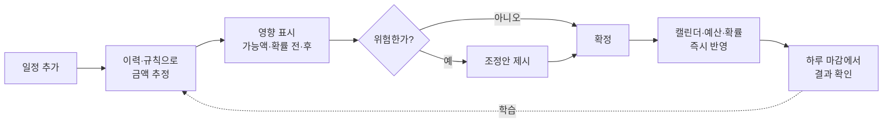

화면에 보이는 숫자가 진짜로 움직여요. 일정을 넣으면 큰 숫자가 내려가고,
예산을 넘으면 그 일정에 경고가 붙어요.
"다음 주로 옮기기"를 누르면 일정이 옮겨지고 이번 주 금액이 돌아와요.

<br/>

<a id="chat-flow"></a>

## 💬 대화는 이렇게 동작해요

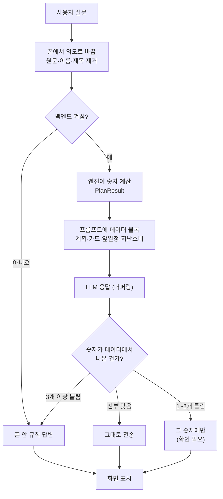

**토큰을 흘려보내지 않고 서버에서 모았다가 검사해요.** 스트리밍으로 바로 내보내면
마지막 토큰에서 허위 금액이 나와도 되돌릴 수 없거든요. 검사를 통과한 뒤에만 화면에 실어요.

허용 숫자는 이렇게 만들어요 (`allowed_chat_numbers`).

| 넣는 값 | 왜 |
|---|---|
| 엔진이 만든 숫자 (`grounded_numbers`) | 계획의 근거 |
| 앱 화면 숫자 (`app_numbers`) | 화면이 62,000원인데 챗봇이 다른 말 하면 안 됨 |
| 카드 청구액·결제일 | 월 예산엔 안 들어가지만 조언엔 필수 |
| 일정별 금액·날짜 | "그 약속 얼마였지?" |
| **유형별 합계·전체 합계** | 우리가 시킨 덧셈 결과가 '지어낸 숫자'로 걸리면 안 됨 |
| **위 값들의 반올림** | "약 12만원"을 허용하되 125,000원은 막으려고 |

반올림은 허용 오차를 넓히는 대신 **반올림한 값 자체를 명단에 넣어요.**
오차를 5,000원으로 잡으면 542,630원이 허용됐다는 이유로 545,000원까지 통과하거든요.

<br/>

<a id="algorithms"></a>

## 🧮 알고리즘

### 추가 사용 가능액 · `WeekLedger` + `AppModel.weeklyBudget`

```
월 배분 가능액 = 월 수입 − 고정비 − 저축 목표 − 다음 달 할부 이월
주차 기본 배분 = 월 배분 가능액 × (그 주가 이번 달에 포함한 날짜 수 ÷ 월 일수)
주차 실제 배분 = 주차 기본 배분 + 지난주 이월
추가 사용 가능액 = max(0, max(0, 주차 실제 배분) × 방향계수 − 이번 주 일정비)
다음 주 이월 = 주차 실제 배분 − 이번 주 일정비
```

달 첫 주와 마지막 주는 며칠 안 되니까 그만큼만 나눠줘요.
나누다 남은 1~2원은 마지막 주에 몰아서 월 총액이 안 틀어지게 해요.
지난주에 더 썼으면 그 마이너스도 그대로 넘겨요. 안 그러면 초과분이 그냥 사라지거든요.

| 방향 | 주간 계수 | 일정 밖 소액 계수 |
|---|:--:|:--:|
| 🔵 줄이기 | `0.86` | `0.60` |
| ⚪ 유지 | `1.00` | `1.00` |
| 🟠 늘리기 | `1.18` | `1.35` |

### 목표 달성 확률 · `BudgetEngine.probability`

몬테카를로 대신 정규근사를 써요. 백엔드 시뮬레이션과 ±1%p 이내로 맞아요.

```
μ    = 남은 확정 일정 + 일정 밖 소액(7,500원/일 × 남은 일수 × 방향계수)
z    = (남은 예산 − μ) / σ        σ = 100,000
확률  = Φ(z)                      Φ = 표준정규 누적분포
```

### 반복 소비 패턴 · `SpendHistory`

같은 이름이 2번 이상 나오면 "반복되는 소비"로 봐요.
몇 일마다 쓰는지, 얼마나 규칙적인지, 보통 얼마 쓰는지를 계산해요.

```
규칙성 = clamp(1 − (주기 편차 ÷ 평균 주기) ÷ 0.5,  0,  1)
```

주기가 들쭉날쭉하지 않을수록 1에 가까워요.
규칙적인 소비는 금액보다 **"몇 주마다 쓰시더라"**를 근거로 말해요.

| 패턴 | 주기 | 평균 금액 | 규칙성 |
|---|---|---:|---:|
| 와드 | 42일 (6주) | 40,000원 | `1.00` |
| 쿠팡 장보기 | 10일 | 35,000원 | `0.93` |
| 주말 데이트 | 14일 (2주) | 70,000원 | `1.00` |
| 미용실 | 49일 (7주) | 26,000원 | `1.00` |
| 카페 | 표본 2건 | 중앙값 20,000원 | 표본 수·관측 범위 표시 |

### 일정 태깅

일정 하나에 꼬리표를 두 개 붙여요.

- **결제 업종** — 무엇에 썼나 (외식·카페·교통…)
- **생활 목적** — 왜 썼나 (데이트·공부·모임…)

스타벅스에서 긁었다는 것만으로는 데이트였는지 공부였는지 모르잖아요.
분석 화면은 이 둘을 합쳐서 꼭 필요한 지출과 아닌 걸로 나눠요.

<br/>

<a id="principles"></a>

## 📐 설계 원칙

**숫자는 코드가, 문장은 LLM이**
추가 사용 가능액·달성 확률·혜택 계산은 결정론 엔진(`BudgetEngine`, `RecoEngine`, `SpendHistory`)이 해요.
LLM은 **우리가 준 데이터 안에서만** 말해요. 준 값을 더하거나 비교하는 건 되지만,
없는 값을 만들어내는 건 안 돼요. `app/eval/groundedness.py`가 그 경계를 지켜요.

```
허용   12,000원 + 8,000원 = 20,000원   ← 준 데이터로 계산
허용   118,500원을 "약 12만원"으로     ← 반올림
차단   125,000원                       ← 어디에도 없는 값
```

근거 없는 숫자를 찾으면 **그 숫자에만 `(확인 필요)` 표시**를 붙여요.
답변 전체를 버리면 맞는 문장까지 같이 사라지니까요.
다만 셋 이상이면 답변 대부분이 지어낸 것이므로 결정론 템플릿으로 바꿔요.
표시를 붙였든 바꿨든 **평가 점수에는 모델 실패로 그대로 집계**해요 —
안전 폴백과 모델 품질을 같은 100%로 포장하지 않으려고요.

**서버가 없어도 돌아가요**
`BudgetEngine`은 백엔드 `app/engine`을 Swift로 똑같이 옮긴 거예요.
서버가 꺼져 있어도 같은 숫자가 나와요. 서버는 문장을 더 자연스럽게 만들 뿐이에요.

**될 것처럼 말하지 않아요**
신용카드는 "발급됩니다"가 아니라 "심사를 받아야 해요"라고 해요.
신청 기간이 끝난 상품에 "가입할 수 있어요"를 붙이지 않아요.
카드 실적 채우려고 더 쓰라는 말은 안 해요.

<br/>

<a id="stack"></a>

## 🛠 기술 스택

| 영역 | 사용 기술 |
|---|---|
| 📱 iOS | Swift · SwiftUI (iOS 26.5) · EventKit · Vision(기기 내 OCR) · PhotosUI |
| ⚙️ 백엔드 | Python · FastAPI · Uvicorn · httpx |
| 🤖 LLM | Anthropic Claude · OpenAI API · OpenAI 호환 로컬 모델 · 오프라인 템플릿 |
| ✅ 테스트 | pytest · XCTest |

LLM은 `LLM_BACKEND`로 골라요. `offline`(템플릿, 비용 0) · `local`(OpenAI 호환) · `claude` · `openai`.
무엇을 고르든 실패하면 템플릿으로 넘어가요.

<br/>

<a id="structure"></a>

## 📂 파일 구조

```
KB_Tune/                      iOS 앱 (SwiftUI, iOS 26.5)
├─ Models.swift               AppModel — 캘린더·예산·예측 상태의 단일 출처 + SpendState
├─ BudgetEngine.swift         추가 사용 가능액·목표 확률 (백엔드 엔진의 Swift 포트)
├─ SpendHistory.swift         과거 이력 → 반복 패턴 탐지 → 금액 예측 + 근거 문장
├─ EventEstimator.swift       일정 제목 → 예상 지출 (이력 우선, 규칙 폴백)
├─ RecoEngine.swift           결정론 상품 추천 (연령·실적 하드필터 → 순혜택 계산)
├─ Products.swift             KB 상품 카탈로그 (기준서 v2 기반)
├─ ContentView.swift          진입 흐름 (스플래시 → 온보딩 → 메인 탭)
├─ MainTabView.swift          하단 4탭 · 스와이프 전환 · 주간 탭 재선택 시 초기화
├─ WeeklyPlanView.swift       주간·월간 계획, 타임테이블, 하루 마감, 예상 소비, 위험 조정
├─ ChatbotView.swift          대화 (백엔드 스트리밍 + 로컬 폴백)
├─ AnalysisView.swift         필수/기타 지출 분해 · 쓴 돈·나갈 돈 색 구분 · 캡처 업로드
├─ ProductsView.swift         현금흐름 요약 → 카드·적금 비교
├─ AddEventView.swift         일정 추가 3단계 (입력 → 추정·영향 → 확정)
├─ OnboardingView.swift       온보딩 (캘린더 연결 → 수입·목표 → 취향 → 방향)
├─ SettingsView.swift         수입·저축 목표·취향 수정
├─ CalendarStore.swift        EventKit 실연동 (기기 캘린더 읽기)
├─ AgentService.swift         질문 원문→금융 의도 변환 · 지난 소비/일정을 제목 없이 전달
├─ EventPhrase.swift          자연어 문장에서 날짜·금액 뽑기 (기기 안에서)
├─ LocalStore.swift           기기 저장 (보호등급 complete · 백업 제외)
├─ SpeechService.swift        온디바이스 음성 인식 (서버 전송 없음)
├─ OCRService.swift           기기 내 Vision OCR + 거래 구조화
└─ DesignSystem.swift         KB 컬러 토큰 · 공용 스타일 · 금액 포맷

backend/                      FastAPI (선택 — 없어도 앱 동작)
├─ app/engine/                결정론 엔진 (계획·추정·분류·예측·확률)
├─ app/llm/                   Claude·OpenAI·로컬 모델 호출 (설명·대화)
├─ app/eval/                  골든 케이스 + groundedness 검사
└─ app/data.py                데모 입력 (프로필·고정비·일정)
```

<br/>

<a id="run"></a>

## ▶️ 실행

**iOS**
```bash
open KB_Tune.xcodeproj      # Xcode 26.6+, iOS 26.5 시뮬레이터
```
`KB_Tune/`는 file-system-synchronized group이에요. `.swift` 파일을 넣으면 자동으로 빌드에 포함돼요.

**백엔드** (선택)
```bash
cd backend
pip install -r requirements.txt
cp .env.example .env         # ANTHROPIC_API_KEY (없으면 규칙 기반으로만 동작)
uvicorn app.main:app --reload
```

**테스트**
```bash
cd backend && pytest -q      # 엔진·AI·보안 회귀 (69개)
# iOS 단위 테스트: 61개
# 핵심 UI: 자연스러운 대화·액션, 온디바이스 카페 일정 제안 자동 검증
```

기본 묶음은 키도 네트워크도 없이 돌아요. 문서용 캡처는 따로 잠가 뒀어요.

```bash
# docs/screens/ 에 화면 11장을 다시 찍어요 (기기 안에서만 모드 — 네트워크 불필요)
TEST_RUNNER_KB_TUNE_CAPTURE_ALL=1 \
TEST_RUNNER_KB_TUNE_SCREENSHOT_DIR=$PWD/docs/screens \
  xcodebuild test -scheme KB_Tune -destination 'platform=iOS Simulator,name=iPhone 17 Pro' \
  -only-testing:KB_TuneUITests/KB_TuneUITests/testCaptureAllScreens \
  -only-testing:KB_TuneUITests/KB_TuneUITests/testCaptureOnboarding
```

실제 백엔드에 붙는 대화 캡처는 서버가 떠 있어야 해요.

```bash
cd backend && ./run.sh       # 먼저 백엔드를 띄우고
# XCUITest는 TEST_RUNNER_ 접두사가 붙은 것만 테스트 러너로 넘겨줘요.
TEST_RUNNER_KB_TUNE_LIVE_CHAT=1 \
TEST_RUNNER_KB_TUNE_SCREENSHOT_DIR=$PWD/../docs/screens \
  xcodebuild test -scheme KB_Tune -destination 'platform=iOS Simulator,name=iPhone 17 Pro' \
  -only-testing:KB_TuneUITests/KB_TuneUITests/testLiveChatAnswersPastSpendingScreenshot
```

<br/>

## 📊 데모 데이터

2026년 7월 캘린더 기준이에요. 확인값과 데모 가정이 섞여 있고, 앱에서도 구분해서 표시해요.

| 구분 | 값 |
|---|---|
| ✅ 확인값 — 월 고정비 | 435,000원 (통신 7.5 · 교통 15 · 유류 6 · 구독 3 · 청약 10 · 보험 2만) |
| ✅ 확인값 — 단건 | 정장 15만 · 결혼식 7만 · 데이트 10만 · 제모 5만 · 와드 4만 |
| ✅ 확인값 — 출근 | **0원** (점심 무비용, 교통·유류는 고정비에 포함) |
| 🔸 가정 | 월 수입 220만 · 저축 목표 80만 · 일정 밖 소액 7,500원/일 |

7월 캘린더 일정비 합계는 **881,000원**이에요(`julyEstimateHigh`, 테스트가 잠가 둔 값).
이번 주 추가 사용 가능액은 월 가용액을 실제 주간 일수로 배분한 뒤 지난주 이월과 카드 할부를
반영해 매번 다시 계산합니다. 기본 시연 상태는 지난주 초과 사용을 반영한 **0원**이며,
조정안을 실행하면 즉시 회복되는 흐름을 보여줍니다.

> [!WARNING]
> 금액을 바꾸실 때는 **iOS `BudgetEngine` · 백엔드 `app/data.py` · 양쪽 테스트를 함께** 고쳐주세요.
> 세 곳이 같은 숫자를 보도록 테스트가 잠가 두었어요.

> [!NOTE]
> **분석 탭 숫자는 따로예요.**
> `AnalysisView`의 필수/기타 금액은 캘린더 합계가 아니라 페르소나의 한 달 실지출을 정리한 값이에요(약 1,602,000원).
> 캘린더 일정비와 일부러 따로 움직여요. 두 숫자가 다른 건 버그가 아니에요.

> [!CAUTION]
> **카드·적금 탭의 "7월 예상 지출"은 아직 별도 값(801,000원)이에요.**
> `AppModel.spendProfile`에 손으로 적어 둔 프로파일을 쓰고 있어서 캘린더 합계 881,000원과 어긋나요.
> 카드 혜택 계산 자체는 `RecoEngine.normalizedCardSpend`가 캘린더에서 다시 뽑아 쓰므로 영향이 없지만,
> **화면에 보이는 숫자는 아직 하나로 모이지 않았어요.** 정리 대상입니다.

<br/>

## 🗺 다음 과제

| 단계 | 기간 | 구현·검증 목표 | 완료 기준 |
|:--:|---|---|---|
| 1 | 제출 전 | 개인정보 카나리·숫자 접지·핵심 데모 회귀 | 핵심 자동 테스트와 스크린샷 증빙 고정 |
| 2 | 1개월 | 시간 순 홀드아웃 예측 평가·카테고리별 오차 보정 | MAE/MAPE 공개 · 단순 평균 기준선보다 개선 |
| 3 | 2개월 | KB Pay 샌드박스 연동·토큰 기반 사용자 인증 | 원본 미저장 · 동의 철회 즉시 반영 · 위협모델 리뷰 |
| 4 | 3개월 | 20명 파일럿과 일정–거래 매칭 고도화 | 일정 추가 성공률·예산 이해도·예측 오차 측정 |

<br/>

<div align="center">
<sub>KB AI Challenge 2026 · 내부 검토용</sub>
</div>
