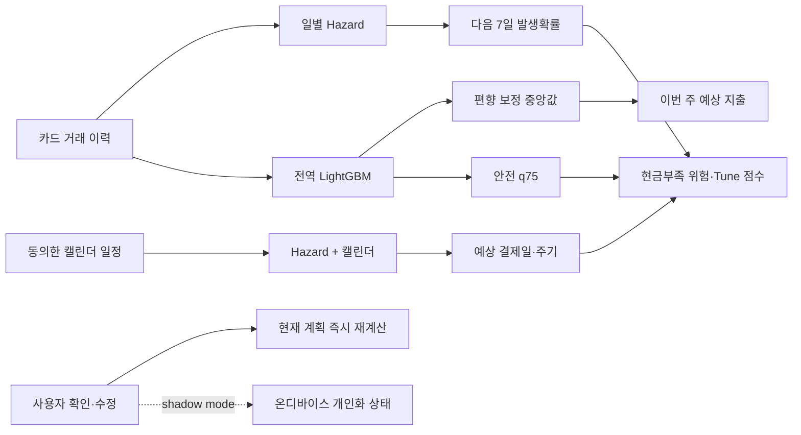
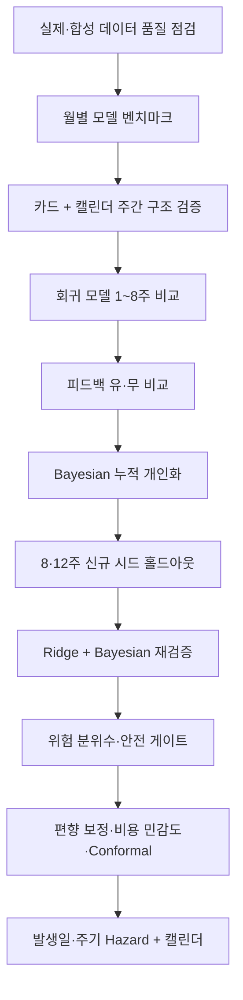
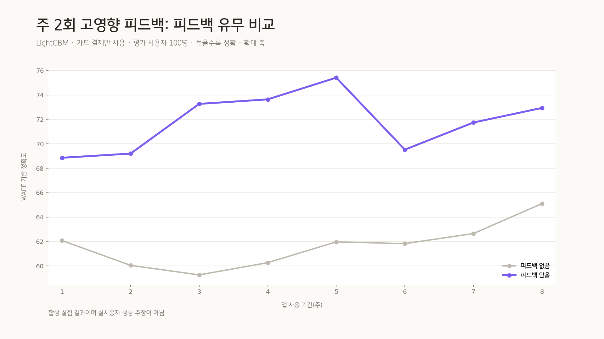
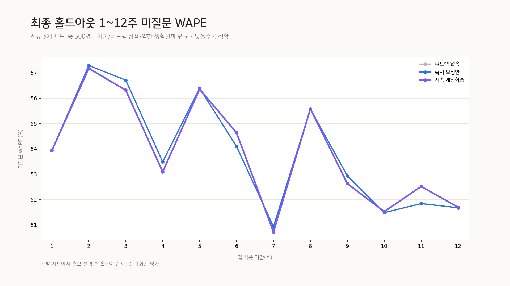
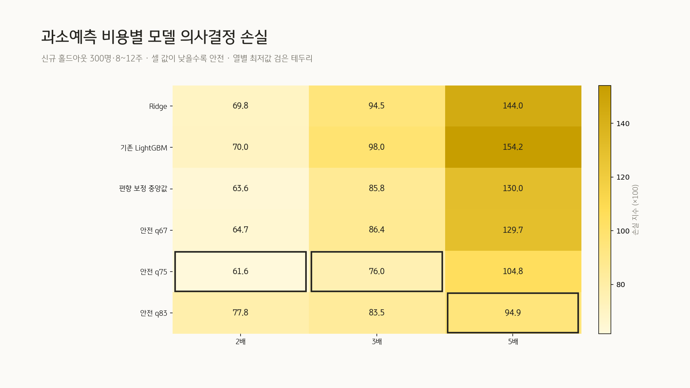
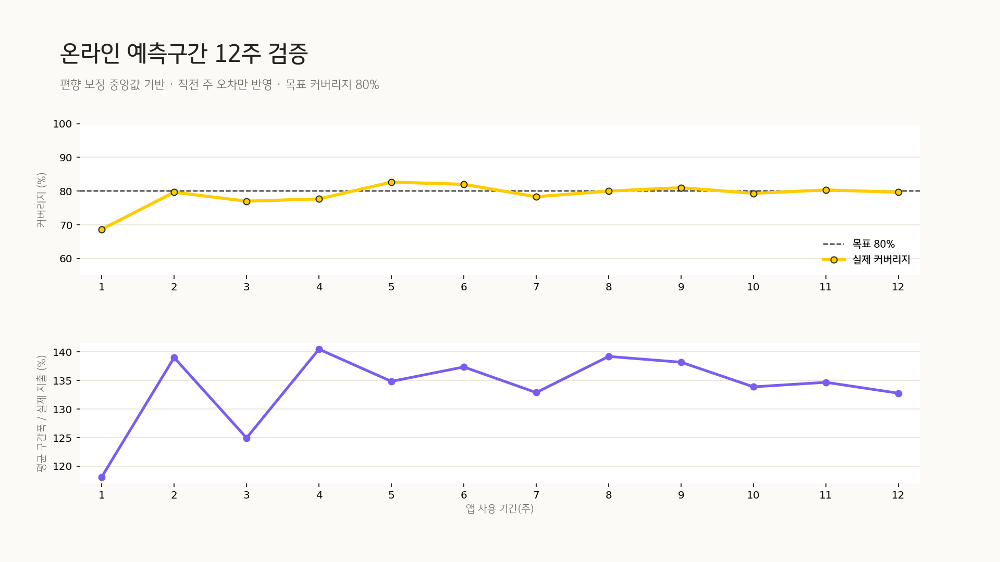
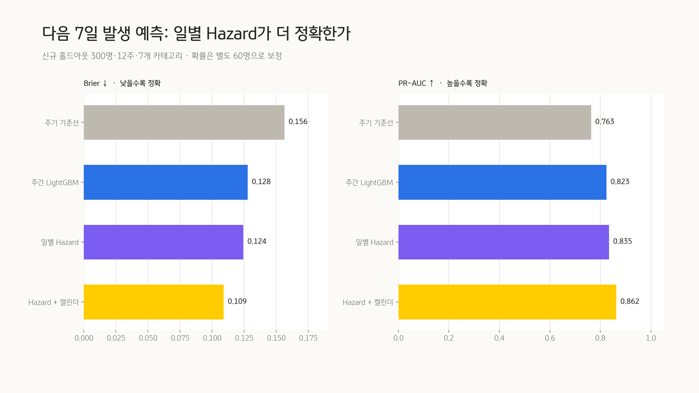
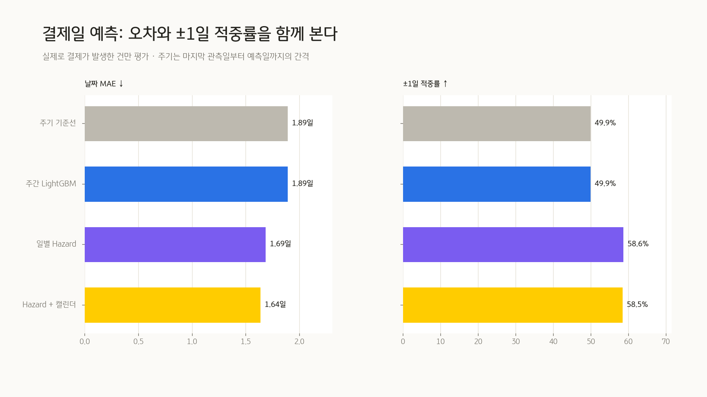

# KB Tune 소비 예측 실험 종합 정리

> 작성일: 2026-07-30  
> 범위: 현금 결제를 제외한 카드 거래·캘린더·사용자 피드백 기반 소비 예측  
> 목적: 오늘 수행한 데이터 점검, 모델 비교, 개인화, 위험 예측, 발생일·주기 실험의 결과와 제품 적용 결정을 한 문서로 정리한다.

## 기술 요약

오늘 실험에서 얻은 결론은 **하나의 모델이 모든 문제를 해결하지 못하며, 예측 목적별로 모델을 분리해야 한다**는 것이다.

- **다음 주 중앙 금액 예측:** LightGBM이 WAPE 기준으로 가장 정확했다. 다만 지속적인 과소예측이 있어, 별도 보정 사용자로 편향을 보정한 중앙값을 사용해야 한다.
- **예산 부족 방어:** 과소예측 비용을 과대예측의 3배로 보면 q75 LightGBM이 의사결정 손실을 가장 낮췄다. 중앙 예측과 안전 예측을 같은 숫자로 사용하면 안 된다.
- **발생 여부·결제일:** 일별 discrete-time Hazard가 주간 모델보다 좋았고, 캘린더를 추가하면 일정형 소비의 날짜 MAE가 0.69일에서 0.44일로 감소했다.
- **사용자 피드백:** 주 2회 질문은 현재 주 예측을 크게 개선했지만, 질문하지 않은 항목까지 장기적으로 좋아지는 효과는 확인하지 못했다.
- **누적 Bayesian 개인화:** 안정적인 개인 성향을 강하게 가정한 초기 통제 실험에서는 좋아졌지만, 신규 시드·생활변화·피드백 잡음을 포함한 홀드아웃에서는 일반화되지 않았다. 따라서 현재 제품 기본값으로 배포하지 않는다.
- **최신 대형 시계열 모델:** Chronos-2는 LightGBM과 온디바이스 Bayesian보다 낮은 성능을 보여 도입 근거가 없었다.
- **불확실성 구간:** 온라인 conformal은 약 79% 커버리지를 달성했지만 평균 구간폭이 실제 지출의 약 134%로 너무 넓었다. 화면에는 정밀한 금액 구간보다 신뢰도 등급을 우선 제시하는 편이 낫다.

따라서 현재 가장 근거가 강한 제품 구조는 다음과 같다.

**현재 배포 판단:** 중앙 금액 보정, q75 위험 예측, 일정형 Hazard + 캘린더를 온디바이스 기본 모델로 통합했다. 누적 Bayesian 개인화, 안전 게이트, Chronos-2, 넓은 conformal 금액 구간은 보류한다.

---

## 1. 실험 전체 흐름

| 단계 | 질문 | 핵심 결과 | 판정 |
|---|---|---|---|
| 데이터 품질 | 보유 자료로 무엇을 검증할 수 있는가 | 지역 자료는 금액 분포만, AI Hub는 월별 성향 보정만 가능 | 제한적 사용 |
| 월별 벤치마크 | 전통·트리·구간·기초모델 중 무엇이 좋은가 | 계층 shrinkage WAPE 0.1297, CQR 커버리지 80.1% | 방법론 참고 |
| 카드+캘린더 | 캘린더가 카드 예측에 실제 신호인가 | WAPE 0.4298 → 0.3815 | 구조 채택 |
| 회귀 모델 | 8주 시점 금액 모델 순위는 무엇인가 | LightGBM 0.3798, Ridge 0.3863 | 둘 다 유지 |
| Chronos-2 | 최신 foundation model이 더 좋은가 | 0.4351로 LightGBM보다 14.6% 나쁨 | 제외 |
| 즉시 피드백 | 주 2회 질문이 현재 예측을 개선하는가 | LightGBM WAPE 0.3489 → 0.2706 | 조건부 채택 |
| 미질문 일반화 | 피드백이 다른 항목까지 학습되는가 | +0.47%p, 95% CI가 0 포함 | 미확인 |
| 누적 Bayesian | 오래 쓸수록 자동으로 좋아지는가 | 엄격한 홀드아웃에서 유의한 개선 없음 | 배포 보류 |
| 위험 분위수 | 과소예측을 더 비싸게 보면 무엇이 좋은가 | 비용 3배에서 q75 최저 손실 | 안전값 채택 |
| 안전 게이트 | 개인화 게이트가 q75를 더 개선하는가 | 8·12주 CI가 0 포함 | 보류 |
| 확률·편향 보정 | 중앙 예측의 구조적 편향을 줄일 수 있는가 | 편향 −14.2% → −2.7%, WAPE도 소폭 개선 | 채택 후보 |
| Conformal | 80% 구간을 정직하게 만들 수 있는가 | 커버리지 78.9%, 폭 133.9% | 화면 노출 보류 |
| 발생일·주기 | 언제 발생할지를 더 잘 맞힐 수 있는가 | Hazard+캘린더 Brier 0.1089, 날짜 MAE 1.64일 | 채택 후보 |

---

## 2. 사용 데이터와 해석 가능한 범위

### 2.1 경기 카드소비데이터

- 10,825행 × 12열, 2024-01-01 하루, 한 시군구 자료다.
- 중복·결측·음수 금액은 없었다.
- 하루 집계이므로 소비 발생일, 주기, 개인화 학습곡선을 검증할 수 없다.
- 카페·외식·생활·자기관리 객단가의 중앙값과 분포 폭을 합성 데이터 생성기의 금액 사전분포 보정에만 사용했다.

### 2.2 AI Hub 금융 합성데이터

- 30,000명 × 6개월의 월별 완전 패널 180,000행을 품질 점검에 사용했다.
- 총액 인접월 상관은 평균 0.938로 개인 성향의 지속성은 강하게 나타났다.
- 합성 월 집계 자료이므로 주간 결제일·주기나 실제 고객 성능을 증명하지 않는다.
- 높은 지속성을 그대로 복제하지 않고, 합성 생성기에서는 0.65 상한의 보수적 설계 근거로만 사용했다.

### 2.3 주간 합성 카드·캘린더 데이터

- 기본 생성 단위는 400명 × 52주다.
- 구독, 생활, 자기관리, 카페, 외식, 모임, 데이트의 7개 카테고리를 포함한다.
- 현금이나 미관측 소비는 넣지 않았으며 모든 실제 소비는 카드 거래로 남는다.
- 일정형 소비는 실제 일정의 75%가 캘린더에 등록되고, 등록 일정의 10%가 취소되도록 생성했다.
- 일부 실험에서는 카드 카테고리 오분류 12%, 응답률 85% 수준, 생활변화와 피드백 잡음을 추가했다.

**해석 경계:** 오늘 결과의 대부분은 합성 데이터 통제 실험이다. 모델 구조의 상대 비교에는 사용할 수 있지만 실제 고객 정확도, 인과효과, 운영 임계값을 확정하지 않는다.

[데이터 품질 보고서](../tools/forecast_bench/results/local_spend_profile/results.md)

---

## 3. 지표 정의

| 지표 | 의미 | 해석 |
|---|---|---|
| WAPE | 전체 절대오차 합 ÷ 실제 지출 합 | 낮을수록 금액 예측이 정확하다 |
| 편향 | 예측 합과 실제 합의 차이 ÷ 실제 합 | 음수는 과소예측, 양수는 과대예측이다 |
| Brier | 발생확률과 실제 발생 여부의 제곱오차 평균 | 낮을수록 발생확률이 정확하다 |
| PR-AUC | 발생 건을 우선 식별하는 정밀도–재현율 성능 | 높을수록 좋다 |
| ECE | 예측확률과 실제 빈도의 보정 오차 | 낮을수록 확률을 그대로 믿기 쉽다 |
| 날짜 MAE | 실제 발생 건에서 예측일과 실제일 차이의 평균 | 낮을수록 좋다 |
| ±1일 적중률 | 실제일 전후 1일 안에 예측한 비율 | 높을수록 좋다 |
| 의사결정 손실 | 과소·과대예측에 서로 다른 비용을 부여한 손실 | 예산 부족을 더 위험하게 볼 때 사용한다 |
| 80% 커버리지 | 예측구간 안에 실제값이 들어온 비율 | 80%에 가까워야 보정된 구간이다 |
| 미질문 WAPE | 해당 주에 직접 묻지 않은 카테고리만 계산한 WAPE | 정답 직접 입력 효과를 제외한 개인화 지표다 |

`WAPE 기반 정확도 = 1 − WAPE`는 설명 편의를 위한 값일 뿐, 일반적인 분류 정확도와 같은 개념이 아니다.

---

## 4. 월별 모델 벤치마크는 방법론 상한만 확인했다

AI Hub 월별 합성자료 5,000명을 시간 순으로 나누어 2018년 11월 학습, 12월 테스트를 수행했다. 최근 평균, seasonal naive, ETS, Croston, Ridge 계열, LightGBM, XGBoost, hurdle, 계층 shrinkage, CQR, marked process, Chronos-2를 비교했다.

| 모델 | WAPE ↓ | 80% 커버리지 | 역할 |
|---|---:|---:|---|
| 개인 과거 평균 | 0.1370 | 65.7% | 기준선 |
| LightGBM hurdle + 계층 shrinkage | **0.1297** | 72.7% | 점예측 1위 |
| + CQR | 0.1300 | **80.1%** | 구간 보정 1위 |
| Chronos-2 zero-shot | 0.1365 | 83.5% | 월별 상한 탐색 |

이 결과는 hurdle과 계층 수축, conformal 보정의 가능성을 보여줬다. 다만 월별 합성자료이기 때문에 KB Tune의 주간 화면이나 결제일 예측 성능 근거로 직접 사용할 수 없다.

[월별 전체 벤치마크](../tools/forecast_bench/results/results.md)

---

## 5. 카드와 캘린더를 결합하는 구조는 유효했다

100명의 마지막 20주를 롤링 평가한 첫 주간 실험에서, 개인 발생확률·금액 모델에 캘린더를 결합하자 전체 WAPE가 0.4298에서 0.3815로 약 11.2% 감소했다. 캘린더가 있는 주만 보면 WAPE 개선은 약 25.1%였다.

| 모델 | WAPE ↓ | 발생 Brier ↓ | 날짜 MAE ↓ |
|---|---:|---:|---:|
| 최근 8주 평균 | 0.4580 | 0.1548 | 2.06일 |
| 개인 발생 × 금액 | 0.4298 | 0.1192 | 2.61일 |
| 개인 발생 × 금액 + 캘린더 | **0.3815** | **0.1064** | 2.20일 |

이 실험은 캘린더가 전체 소비의 정답표가 아니라, **이미 예정된 일정형 소비의 known-future signal**로 쓸 가치가 있음을 보여줬다. 이후 발생일 실험에서는 같은 모델의 캘린더 특징만 켜고 끄는 ablation으로 효과를 다시 확인했다.

[카드·캘린더 벤치마크](../tools/forecast_bench/results/card_calendar/results.md)

---

## 6. 8주 금액 모델 비교: LightGBM이 가장 정확하고 Ridge가 가장 덜 편향됐다

모든 모델에 같은 카드 이력, 카테고리 요약, 경과일, 다음 주 캘린더 특징을 제공했다. 학습 사용자 300명과 평가 사용자 100명을 분리하고, 평가 사용자의 미래 20주를 사용주차별로 다시 예측했다.

| 모델 | 8주 WAPE ↓ | 편향 | 판단 |
|---|---:|---:|---|
| LightGBM | **0.3798** | −6.96% | 점예측 정확도 1위, 과소예측 주의 |
| Ridge | 0.3863 | **−0.15%** | 정확도 차이는 작고 편향이 거의 없음 |
| Random Forest | 0.3921 | +0.59% | 두 후보보다 낮음 |
| KB Tune Hybrid | 0.3939 | −5.95% | LightGBM 편향을 물려받음 |
| KB Tune Bayesian | 0.3993 | −0.22% | 순수 구조 모델이 LightGBM을 이기지 못함 |
| 최근 평균 + 캘린더 | 0.4861 | +22.61% | 기준선 |

그림은 모든 모델을 같은 평가 집합에서 비교한다. WAPE만 보면 LightGBM이 우세하지만 Ridge와의 차이는 0.65%p이며, 예산 부족 위험에서는 LightGBM의 과소편향을 무시할 수 없다. 이 때문에 이후 실험은 “정확도 1위”와 “안전한 의사결정”을 분리했다.

[8주 모델 비교 결과](../tools/forecast_bench/results/model_comparison_8week/results.md)

---

## 7. Chronos-2는 최신 기법이지만 제품 후보가 아니었다

Chronos-2에 최대 51주의 문맥과 캘린더 공변량을 제공해 zero-shot 상한선을 확인했다.

| 조건 | WAPE ↓ | 편향 |
|---|---:|---:|
| LightGBM 참조 | **0.3798** | — |
| KB Tune Bayesian 참조 | 0.3993 | — |
| Chronos-2 + 캘린더 | 0.4351 | −3.35% |
| Chronos-2 총액 | 0.4514 | −3.30% |
| Chronos-2 다변량 + 캘린더 | 0.4546 | −26.83% |

최고 Chronos 조건도 LightGBM보다 14.6%, 온디바이스 Bayesian보다 9.0% 나빴다. 120M 파라미터 서버 모델을 배포하거나 증류할 만큼의 성능 상한이 확인되지 않아 이 경로를 닫았다.

[Chronos-2 주간 실험](../tools/forecast_bench/results/chronos_weekly/results.md)

---

## 8. 주 2회 피드백은 현재 주를 개선하지만 자동 개인화를 증명하지 못했다

피드백 없음과 피드백 있음을 동일한 LightGBM에서 비교했다. 질문은 실제값을 보기 전에 예상 영향도와 불확실성으로 사용자당 주 2개만 선택했다. 응답률은 약 84.5%였다.

| 조건 | 8주 총액 WAPE ↓ | 미질문 WAPE ↓ | 발생 Brier ↓ |
|---|---:|---:|---:|
| 피드백 없음 | 0.3489 | 0.5334 | 0.1210 |
| 피드백 있음 | **0.2706** | **0.5287** | **0.0892** |
| 개선폭 | **7.84%p** | 0.47%p | 0.0318 |

전체 WAPE 개선의 사용자 bootstrap 95% 구간은 2.72~13.01%p로 양수였다. 그러나 미질문 개선의 95% 구간은 −1.29~2.19%p로 0을 포함했다.

이 그림의 차이는 대부분 사용자가 이번 주에 직접 확인한 카테고리에서 발생한다. 따라서 제품에서는 “확인하면 이번 계획이 즉시 정확해진다”고 말할 수 있지만, “답변이 다른 소비까지 자동 학습한다”고 말할 수는 없다.

[즉시 피드백 실험](../tools/forecast_bench/results/active_feedback_8week/results.md)

---

## 9. 초기 Ridge + Bayesian 상승곡선은 이상적인 가정에서만 성립했다

초기 통제 실험은 전역 Ridge에 사용자×카테고리 Bayesian 잔차를 더했다. 개인·카테고리별 선호가 8주 동안 안정적으로 유지되도록 생성한 300명에서 다음 결과가 나왔다.

| 사용주차 | Ridge WAPE | Ridge + Bayesian WAPE |
|---:|---:|---:|
| 1주 | 0.4104 | 0.3606 |
| 8주 | 0.4070 | 0.2071 |

개인화 모델의 1→8주 WAPE는 42.6% 개선됐다. 이 결과는 Bayesian 잔차가 **지속적인 개인 성향이 실제로 존재하고 관측 잡음보다 클 때** 학습될 수 있다는 가설 증거다.

그러나 이 생성기는 생활변화, 질문 선택 편향, 발생 여부, 미질문 평가를 충분히 반영하지 않았다. 같은 사용자 결과를 보며 파라미터를 조정하면 테스트셋 튜닝이 되므로, 이후에는 신규 시드·별도 사용자·다중 시나리오를 한 번만 평가하는 엄격한 실험으로 전환했다.

[초기 Ridge + Bayesian 통제 실험](/Users/muju/Documents/KB%20AI%20Challenge/research/test_ridge_bayesian_personalization.py)

---

## 10. 현실적인 Bayesian 개인화는 8주와 12주 홀드아웃을 통과하지 못했다

### 10.1 개인 Bayesian 8주 재실험

장기 기본값 질문과 현재 주 확인 질문을 분리하고, 현재 주 질문을 제외한 미질문 일반화를 평가했다. 8주에 KB Tune Personal은 LightGBM Active보다 총액 WAPE가 2.29%p 나빴다. 미질문 개선도 −1.94%p였고 95% 구간이 0을 포함했다.

### 10.2 12주 지속학습 3그룹 비교

피드백 없음, 즉시 보정만, 지속 개인학습을 같은 카드 이력에서 비교했다.

| 판정 시점 | 지속학습 추가 개선폭 | 사용자 bootstrap 95% CI | 판정 |
|---:|---:|---:|---|
| 8주 | −2.13%p | −3.99~−0.20%p | 악화 |
| 12주 | +0.43%p | −1.53~+2.56%p | 미확인 |

### 10.3 개발/최종 시드 완전 분리

사전 등록한 7개 Bayesian 후보를 개발 시드 3개에서 비교하고, 선택 후 별도 최종 시드 3개에서 한 번만 평가했다. 개발 단계에서 즉시 보정보다 좋은 후보는 0/7개였다. 가장 덜 나빴던 후보도 최종 홀드아웃에서 8주 −0.02%p, 12주 −0.04%p로 일반화되지 않았다.

이 그림은 같은 주에 직접 질문한 카테고리를 제외한 결과다. 즉시 답변 효과를 제거해도 누적 상태가 좋아지는지 본 것이며, 유의한 상승곡선은 나타나지 않았다.

### 10.4 Ridge 기반 Bayesian도 결론을 바꾸지 못했다

Ridge를 전역 기준선으로 바꾼 뒤 같은 잔차·직접 보정 후보를 개발/홀드아웃으로 평가했다. 개발 시드에서 우세 후보는 다시 0/7개였고, 최종 8주 개선폭은 −0.19%p, 12주는 −0.77%p였다.

**최종 판정:** “오래 쓸수록 모델이 자동으로 계속 좋아진다”는 문구는 현재 증거로 사용할 수 없다. 개인화 레이어는 기기 내 shadow mode로만 기록하고, 실사용자 파일럿에서 통과한 뒤 승격해야 한다.

- [개인 Bayesian 8주 재실험](../tools/forecast_bench/results/personal_bayes_feedback_8week/results.md)
- [지속학습 12주 실험](../tools/forecast_bench/results/persistent_learning_12week/results.md)
- [개발/최종 홀드아웃](../tools/forecast_bench/results/persistent_defaults_holdout_12week/results.md)
- [Ridge + Bayesian 홀드아웃](../tools/forecast_bench/results/ridge_bayesian_holdout_12week/results.md)

---

## 11. 과소예측 비용을 반영하면 q75가 안전 예측값으로 적합했다

예산 앱에서 과소예측은 과대예측보다 더 위험하다. 따라서 WAPE 외에 과소예측 비용을 과대예측의 2배, 3배, 5배로 둔 의사결정 손실을 계산했다.

| 과소예측 비용 | 최저 손실 모델 | 의사결정 손실 |
|---:|---|---:|
| 2배 | 안전 q75 | 0.6164 |
| 3배 | 안전 q75 | 0.7604 |
| 5배 | 안전 q83 | 0.9485 |

q75는 WAPE가 중앙값보다 높지만 과소예측률을 크게 낮췄다. 제품에서는 q75를 “예상 지출”로 표시하지 않고, **목표 방어와 현금부족 위험 계산에 사용하는 안전 상한**으로 분리해야 한다.

그림은 비용 가정에 따라 최적 분위수가 달라진다는 점을 보여준다. Tune 점수에서 과소예측 비용을 3배로 정의한다면 q75가 타당하고, 비용 정의를 바꾸면 분위수도 다시 정해야 한다.

### 안전 게이트 개인화는 추가 개선을 입증하지 못했다

q75 위에 사용자별 안전 게이트를 추가했을 때 8주 개선의 95% CI는 −0.83~3.58, 12주는 −4.90~0.92로 모두 0을 포함했다. 일부 시점의 평균 손실은 낮아졌지만 안정적인 개인화로 인정하지 않았다.

[위험 분위수·안전 게이트 실험](../tools/forecast_bench/results/risk_gated_personalization_12week/results.md)

---

## 12. 중앙값 편향 보정은 유효했지만 Conformal 구간은 너무 넓었다

학습 사용자와 분리된 60명의 마지막 8주로 LightGBM의 총액 편향을 보정하고, 신규 300명·8~12주 결과를 평가했다.

| 조건 | WAPE ↓ | 편향 | 과소예측률 |
|---|---:|---:|---:|
| Ridge | 0.4504 | −4.5% | 49.1% |
| 기존 LightGBM | 0.4192 | −14.2% | 54.5% |
| **편향 보정 중앙값** | **0.4151** | **−2.7%** | 44.6% |
| 안전 q67 | 0.4307 | −0.2% | 42.5% |
| 안전 q75 | 0.4723 | +18.4% | **29.7%** |

중앙값 보정은 WAPE를 소폭 개선하면서 구조적 과소편향을 크게 줄였다. q75는 중앙 예측으로 쓰기에는 과대편향이 크지만 예산 부족 방어용으로는 유용하다.

온라인 conformal의 평균 커버리지는 78.9%로 목표 80%에 가까웠다. 그러나 정규화 구간폭은 평균 133.9%였다. 정확한 금액 범위를 화면에 표시하면 사용성이 떨어질 수 있으므로, 현재는 `낮은 신뢰도`와 보수적 계획을 제시하고 금액 구간은 상세 화면이나 내부 검증용으로 제한한다.

그림은 커버리지가 목표에 근접해도 구간이 실용적으로 좁다는 뜻은 아니라는 점을 보여준다. 커버리지와 폭을 반드시 함께 평가해야 한다.

[편향·위험·Conformal 결과 폴더](../tools/forecast_bench/results/calibrated_risk_conformal_holdout/)

---

## 13. 발생 여부와 결제일은 일별 Hazard + 캘린더가 가장 좋았다

금액 모델과 분리해 `다음 7일 발생 여부 → 가장 가능성 높은 결제일 → 마지막 결제일부터의 주기`를 평가했다. 학습 240명, 확률 보정 60명, 신규 평가 100명을 분리하고 세 개의 신규 시드에서 12주를 평가했다.

| 모델 | Brier ↓ | PR-AUC ↑ | ECE ↓ | 날짜 MAE ↓ | ±1일 적중률 ↑ |
|---|---:|---:|---:|---:|---:|
| 주기 기준선 | 0.1564 | 0.7628 | 0.0251 | 1.89일 | 49.9% |
| 주간 LightGBM | 0.1278 | 0.8233 | **0.0108** | 1.89일 | 49.9% |
| 일별 Hazard | 0.1244 | 0.8346 | 0.0108 | 1.69일 | **58.6%** |
| **Hazard + 캘린더** | **0.1089** | **0.8622** | 0.0133 | **1.64일** | 58.5% |

Hazard + 캘린더는 주간 LightGBM보다 Brier가 약 14.8% 낮았다. 다만 ECE와 ±1일 적중률은 일별 Hazard보다 소폭 나빠, 모든 지표를 압도한 것은 아니다.

날짜 MAE는 1.89일에서 1.64일로 감소했다. 주기는 마지막 관측 결제일부터 예측 결제일까지의 간격으로 정의했기 때문에 이 실험에서 날짜 MAE와 주기 MAE는 수치적으로 같다.

같은 Hazard 모델에서 캘린더 특징만 켜고 끈 결과, 일정형 소비의 날짜 MAE는 0.69일에서 0.44일로 약 35.8% 감소했다. 비일정형 소비는 1.91일로 사실상 같았다. 따라서 캘린더 효과를 모든 소비에 일반화하지 않고 모임·데이트 등 일정형 카테고리에만 적용해야 한다.

사용자 단위 bootstrap 95% CI에서도 Brier 개선은 0.0138~0.0171, 날짜 MAE 개선은 0.04~0.06일로 양수였다. 세 개의 신규 시드 모두 같은 순위를 보였다.

[Hazard + 캘린더 전체 결과](../tools/forecast_bench/results/hazard_calendar_holdout_12week/results.md)

---

## 14. 과적합과 시간 누수를 막기 위해 적용한 규칙

1. **사용자 단위 분리:** 학습, 보정, 최종 평가 사용자를 겹치지 않게 나눴다.
2. **개발/최종 시드 분리:** 파라미터 후보는 개발 시드에서만 고르고, 최종 시드는 선택 후 한 번만 평가했다.
3. **시간 순서 고정:** 현재 주 예측과 평가가 끝난 뒤에만 현재 주 거래나 피드백으로 상태를 갱신했다.
4. **현재 질문 제외:** 누적 개인화 평가는 해당 주에 직접 질문한 카테고리를 주지표에서 제외했다.
5. **다중 시점 공개:** 8주와 12주를 모두 보고 유리한 한 주만 선택하지 않았다.
6. **다중 시나리오:** 기본, 생활변화, 금액 변동성 또는 피드백 잡음을 포함했다.
7. **사용자 bootstrap:** 95% 신뢰구간 하한이 0보다 클 때만 개선을 일반화로 인정했다.
8. **확률 별도 보정:** 발생확률은 모델 학습과 다른 사용자 집합으로 보정했다.
9. **캘린더 ablation:** 같은 Hazard 구조에서 캘린더 특징만 켜고 끄며 효과를 분리했다.
10. **부정 결과 유지:** 개발 후보가 기준선을 이기지 못하면 홀드아웃의 일부 유리한 결과와 관계없이 배포하지 않았다.

이 규칙을 적용하면서 초기의 강한 Bayesian 상승곡선은 제품 근거에서 제외됐다. 이는 실험 실패가 아니라 테스트 데이터 튜닝과 과도한 생성 가정을 걸러낸 결과다.

---

## 15. 개인정보와 AI 정보 누수 경계

오늘 실험은 합성 데이터와 로컬 파일만 사용했고 외부 LLM이나 서버로 개인 거래를 전송하지 않았다. 제품에서는 다음 경계를 유지한다.

- 전역 LightGBM/Hazard 모델은 비식별 집단 데이터로 서버에서 학습한 뒤 모델 파일만 앱에 배포한다.
- 원거래 내역, 캘린더 제목, 사용자 답변 원문은 외부 LLM 입력으로 보내지 않는다.
- 개인 상태가 필요하면 합계, 횟수, EWMA, Bayesian sufficient statistics처럼 복원이 어려운 요약값만 기기에 저장한다.
- 캘린더는 사용자 동의 후 일정 시각과 선택된 범주만 사용하고, 제목 원문은 저장하지 않는다.
- 예측이나 조정안은 자동 실행하지 않고 사용자 승인 후 계획에 반영한다.
- 디버그 로그와 감사 로그에는 원문 거래·일정이 아니라 모델 버전, 입력 특징의 출처 유형, 판단 근거, 사용자 승인 여부만 남긴다.

누적 개인 상태를 서버 재학습에 사용하려면 별도 동의, 최소수집, 보존기간, 삭제 경로, 접근통제가 필요하다. 현재 검증 단계에서는 서버 업로드를 기본으로 두지 않는다.

---

## 16. 최종 제품 적용안

### 16.1 모델 역할

| 제품 판단 | 사용할 값 | 현재 근거 | 상태 |
|---|---|---|---|
| 다음 주 예상 지출 | 편향 보정 LightGBM 중앙값 | WAPE 0.4151, 편향 −2.7% | 온디바이스 통합 |
| 예산 부족 방어 | LightGBM q75 | 과소비용 2·3배에서 최저 손실 | 온디바이스 통합 |
| 다음 7일 발생확률 | 일정형은 Hazard + 캘린더, 그 외 Hazard | Brier 0.1089 | 온디바이스 통합 |
| 예상 결제일 | 일정형은 Hazard + 캘린더, 그 외 Hazard | 일정형 MAE 0.44일 | 온디바이스 통합 |
| 개인 피드백 | 현재 계획 즉시 재계산 | 전체 WAPE 7.84%p 개선 | 제한적 사용 |
| 누적 자동 개인화 | 온디바이스 shadow mode | 신규 홀드아웃 미통과 | 비노출 |
| 예측 신뢰도 | 데이터량·확률보정·구간폭 기반 등급 | Conformal 구간이 너무 넓음 | 등급 우선 |

### 16.2 Tune 점수 연결

Tune 점수는 한 모델의 출력이 아니라 다음 정보를 결합하는 의사결정 값이어야 한다.

- 편향 보정 중앙값으로 계산한 목표 달성 가능성
- q75를 사용한 계획 기간 내 현금부족 위험
- Hazard + 캘린더의 발생확률과 예상 결제일
- 사용자가 보호 소비로 지정한 제약
- 조정안이 보호 소비와 목표에 미치는 비용
- 데이터가 적거나 구간이 넓을 때의 신뢰도 감점

모델이 낮은 점수를 내더라도 앱이 자동으로 일정을 취소하거나 적금을 변경하지 않는다. 추천·제외 이유를 보여주고 사용자가 승인했을 때만 재계산한다.

### 16.3 온디바이스 적용 계약

- `export_ondevice_models.py`가 고정 시드로 모델을 다시 학습해 중립 JSON 트리와 골든 입력을 만든다.
- `ForecastEngine.swift`가 원거래를 전송하지 않고 기기에서 트리를 평가한다.
- 금액 중앙값은 별도 보정 계수, 안전액은 q75, 발생확률은 별도 사용자 집합의 로지스틱 보정을 사용한다.
- 캘린더 모델은 홀드아웃에서 이득이 확인된 `모임`·`데이트`에만 쓰고, 제목 원문은 피처에 넣지 않는다.
- Tune 상세와 승인·거절 감사 로그에 모델·피처 버전을 함께 기록한다.
- `ForecastModelTests.swift`가 Python과 Swift의 중앙값·q75·발생확률·예상일 일치를 검증한다.

### 16.4 사용자에게 할 수 있는 표현과 하면 안 되는 표현

| 사용 가능 | 현재 사용 금지 |
|---|---|
| “카드 이력과 등록된 일정으로 다음 주 위험을 미리 계산합니다.” | “오래 쓸수록 자동으로 계속 정확해집니다.” |
| “이번 주 확인한 계획을 반영해 예측을 바로 다시 계산합니다.” | “피드백이 다른 모든 소비까지 학습합니다.” |
| “일정형 소비는 등록된 날짜를 활용해 결제일 범위를 좁힙니다.” | “캘린더가 모든 소비 날짜를 정확히 맞힙니다.” |
| “안전 예상액은 과소예측 위험을 줄이기 위한 보수적 값입니다.” | “q75가 실제 지출의 정확한 예상값입니다.” |
| “현재 데이터가 적어 신뢰도가 낮습니다.” | “80% 구간이면 실제로 항상 80% 맞습니다.” |

---

## 17. 다음 검증 우선순위

### 1순위 — 20~50명, 12주 shadow-mode 파일럿

- 실제 카드 거래에서 편향 보정 중앙값, q75, Hazard 발생확률을 함께 저장한다.
- 사용자는 예측을 보지 않거나, 보더라도 실제 계획 변경과 모델 평가를 분리한다.
- 8주와 12주에 WAPE, 편향, Brier, ECE, 날짜 MAE, ±1일 적중률을 평가한다.
- 누적 개인화는 화면에 노출하지 않고 즉시 보정 기준선과 비교한다.

### 2순위 — 카테고리별 발생일 실데이터 검증

- 구독·고정납부·모임·데이트·외식처럼 패턴이 다른 범주를 분리한다.
- 캘린더가 있는 일정형과 없는 일정형을 나눠 선택편향을 확인한다.
- 일정 취소, 일정 제목 분류 오류, 카드 업종 오분류를 별도 ablation으로 측정한다.

### 3순위 — Tune 점수의 비용함수 검증

- 과소예측 비용 2·3·5배 중 어떤 값이 실제 사용자 선택과 맞는지 확인한다.
- q75가 지나치게 보수적이면 사용자가 경고를 무시하는지 측정한다.
- Tune 점수 상승이 실제 목표 유지율과 현금부족 감소로 이어지는지 확인한다.

### 4순위 — 개인화 승격 조건

다음 조건을 모두 통과할 때만 누적 Bayesian을 제품 후보로 승격한다.

1. 미질문 WAPE 개선의 사용자 bootstrap 95% CI 하한이 0보다 크다.
2. Brier와 편향이 기준선보다 악화되지 않는다.
3. 기본·생활변화·피드백 잡음 시나리오 모두에서 같은 방향이다.
4. 8주뿐 아니라 12주에서도 개선이 유지된다.
5. 개선 사용자 비율과 악화 사용자 비율을 함께 공개한다.

---

## 18. 아직 답하지 못한 질문

- 실제 사용자에게 어떤 질문이 가장 낮은 부담으로 가장 큰 예측 개선을 만드는가?
- 캘린더 동의 사용자는 비동의 사용자와 소비 패턴이 다른가?
- 일정 취소와 카드 승인 지연을 포함하면 날짜 MAE가 얼마나 변하는가?
- q75의 보수성이 경고 피로와 목표 유지 사이에서 어떤 절충을 만드는가?
- 온디바이스 모델 파일 크기, 추론 시간, 배터리 사용량이 실제 배포 기준을 만족하는가?
- 개인화가 평균적으로는 작아도 특정 고변동 사용자군에서는 유의하게 작동하는가?

---

## 19. 재현 자료 인덱스

| 실험 | 코드 | 결과 |
|---|---|---|
| 월별 AI Hub 벤치마크 | [`run_bench.py`](../tools/forecast_bench/run_bench.py) | [`results.md`](../tools/forecast_bench/results/results.md) |
| 로컬 데이터 품질 | [`profile_local_spend_data.py`](../tools/forecast_bench/profile_local_spend_data.py) | [`local_spend_profile`](../tools/forecast_bench/results/local_spend_profile/results.md) |
| 카드 + 캘린더 | [`card_calendar_bench.py`](../tools/forecast_bench/card_calendar_bench.py) | [`card_calendar`](../tools/forecast_bench/results/card_calendar/results.md) |
| 8주 모델 비교 | [`model_comparison_8week.py`](../tools/forecast_bench/model_comparison_8week.py) | [`model_comparison_8week`](../tools/forecast_bench/results/model_comparison_8week/results.md) |
| Chronos-2 | [`chronos_weekly.py`](../tools/forecast_bench/chronos_weekly.py) | [`chronos_weekly`](../tools/forecast_bench/results/chronos_weekly/results.md) |
| 즉시 피드백 | [`active_feedback_bench.py`](../tools/forecast_bench/active_feedback_bench.py) | [`active_feedback_8week`](../tools/forecast_bench/results/active_feedback_8week/results.md) |
| 개인 Bayesian 8주 | [`personal_bayes_feedback_bench.py`](../tools/forecast_bench/personal_bayes_feedback_bench.py) | [`personal_bayes_feedback_8week`](../tools/forecast_bench/results/personal_bayes_feedback_8week/results.md) |
| 지속학습 12주 | [`persistent_learning_12week.py`](../tools/forecast_bench/persistent_learning_12week.py) | [`persistent_learning_12week`](../tools/forecast_bench/results/persistent_learning_12week/results.md) |
| 지속 기본값 홀드아웃 | [`persistent_defaults_holdout_12week.py`](../tools/forecast_bench/persistent_defaults_holdout_12week.py) | [`persistent_defaults_holdout_12week`](../tools/forecast_bench/results/persistent_defaults_holdout_12week/results.md) |
| Ridge + Bayesian 홀드아웃 | [`ridge_bayesian_holdout_12week.py`](../tools/forecast_bench/ridge_bayesian_holdout_12week.py) | [`ridge_bayesian_holdout_12week`](../tools/forecast_bench/results/ridge_bayesian_holdout_12week/results.md) |
| 위험 분위수·게이트 | [`risk_gated_personalization_12week.py`](../tools/forecast_bench/risk_gated_personalization_12week.py) | [`risk_gated_personalization_12week`](../tools/forecast_bench/results/risk_gated_personalization_12week/results.md) |
| 편향·비용·Conformal | [`calibrated_risk_conformal_holdout.py`](../tools/forecast_bench/calibrated_risk_conformal_holdout.py) | [`calibrated_risk_conformal_holdout`](../tools/forecast_bench/results/calibrated_risk_conformal_holdout/) |
| 발생일·주기 Hazard | [`hazard_calendar_holdout_12week.py`](../tools/forecast_bench/hazard_calendar_holdout_12week.py) | [`hazard_calendar_holdout_12week`](../tools/forecast_bench/results/hazard_calendar_holdout_12week/results.md) |

## 최종 한 줄 결론

**KB Tune은 “하나의 개인화 AI”가 아니라, 편향 보정 중앙값·위험 분위수·일별 Hazard·캘린더·사용자 승인 피드백을 역할별로 결합하고, 아직 검증되지 않은 누적 개인화는 정직하게 shadow mode에 두는 금융 의사결정 시스템으로 가는 것이 가장 타당하다.**
